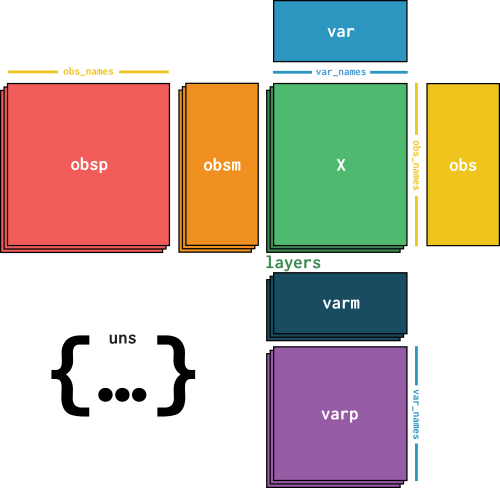

# 导入模块

```Python
import numpy as np
import pandas as pd
import matplotlib.pyplot as plt
import seaborn as sns
import pooch
import anndata
import scanpy as sc
```

# 数据下载与导入

下载并导入.h5ad文件：已经预处理的 PBMC 数据集

[scverse-getting-started-anndata-pbmc3k_processed.h5ad](01.f42be259-849d-43ee-bd34-e610de1f0ede/scverse-getting-started-anndata-pbmc3k_processed.h5ad)

```Python
datapath = "./data/scverse-getting-started-anndata-pbmc3k_processed.h5ad"
adata = anndata.read_h5ad(datapath)
"""
AnnData object with n_obs × n_vars = 2638 × 11505
    obs: 'n_genes', 'percent_mito', 'n_counts', 'louvain_cell_types'
    var: 'gene_names', 'n_cells', 'gene_ids'
    uns: 'louvain', 'louvain_colors', 'pca'
    obsm: 'X_pca', 'X_tsne', 'X_umap'
    layers: 'raw'
    obsp: 'distances_all'
"""

adata_df = adata.to_df()
"""
gene_names        LINC00115  NOC2L  KLHL17  PLEKHN1  HES4     ISG15  AGRN  ...    MT-CO3    MT-ND3   MT-ND4L    MT-ND4    MT-ND5  MT-ND6    MT-CYB
cell_barcode                                                               ...                                                                    
AAACATACAACCAC-1        0.0    0.0     0.0      0.0   0.0  0.000000   0.0  ...  1.718197  0.649662  0.000000  2.317369  0.649662     0.0  1.538924
AAACATTGAGCTAC-1        0.0    0.0     0.0      0.0   0.0  0.000000   0.0  ...  2.049184  0.642665  0.000000  2.764773  0.372095     0.0  1.527396
AAACATTGATCAGC-1        0.0    0.0     0.0      0.0   0.0  0.532456   0.0  ...  1.338269  0.000000  0.000000  1.134407  0.878057     0.0  1.338269
AAACCGTGCTTCCG-1        0.0    0.0     0.0      0.0   0.0  2.144639   0.0  ...  1.470325  0.000000  0.608494  1.256467  0.984071     0.0  0.984071
AAACCGTGTATGCG-1        0.0    0.0     0.0      0.0   0.0  0.000000   0.0  ...  1.179840  0.000000  0.000000  0.000000  1.706149     0.0  1.179840
...                     ...    ...     ...      ...   ...       ...   ...  ...       ...       ...       ...       ...       ...     ...       ...
TTTCGAACTCTCAT-1        0.0    0.0     0.0      0.0   0.0  2.298200   0.0  ...  1.811211  0.494533  0.000000  0.494533  0.000000     0.0  0.494533
TTTCTACTGAGGCA-1        0.0    0.0     0.0      0.0   0.0  0.496017   0.0  ...  1.703869  0.000000  0.496017  0.826074  0.496017     0.0  1.272192
TTTCTACTTCCTCG-1        0.0    0.0     0.0      0.0   0.0  0.000000   0.0  ...  2.320006  0.000000  0.000000  2.320006  0.000000     0.0  1.831505
TTTGCATGAGAGGC-1        0.0    0.0     0.0      0.0   0.0  0.000000   0.0  ...  1.670896  0.000000  1.150086  0.000000  0.000000     0.0  1.150086
TTTGCATGCCTCAC-1        0.0    0.0     0.0      0.0   0.0  0.000000   0.0  ...  0.750617  0.000000  0.000000  0.750617  0.000000     0.0  1.471306

[2638 rows x 11505 columns]
"""

adata_shape = adata.shape
"""
(2638, 11505)
"""

adata_nobs = adata.n_obs              # 细胞数量
"""
2638
"""

adata_obs_names = adata.obs_names     # 细胞条码
"""
Index(['AAACATACAACCAC-1', 'AAACATTGAGCTAC-1', 'AAACATTGATCAGC-1',
       'AAACCGTGCTTCCG-1', 'AAACCGTGTATGCG-1', 'AAACGCACTGGTAC-1',
       'AAACGCTGACCAGT-1', 'AAACGCTGGTTCTT-1', 'AAACGCTGTAGCCA-1',
       'AAACGCTGTTTCTG-1',
       ...
       'TTTCAGTGTCACGA-1', 'TTTCAGTGTCTATC-1', 'TTTCAGTGTGCAGT-1',
       'TTTCCAGAGGTGAG-1', 'TTTCGAACACCTGA-1', 'TTTCGAACTCTCAT-1',
       'TTTCTACTGAGGCA-1', 'TTTCTACTTCCTCG-1', 'TTTGCATGAGAGGC-1',
       'TTTGCATGCCTCAC-1'],
      dtype='object', name='cell_barcode', length=2638)
"""

adata_obs_colums = adata.obs_keys()   # 细胞信息列名
"""
['n_genes', 'percent_mito', 'n_counts', 'louvain_cell_types']
"""

adata_nvars = adata.n_vars            # 基因数量
"""
11505
"""

adata_var_names = adata.var_names     # 基因名称
"""
Index(['LINC00115', 'NOC2L', 'KLHL17', 'PLEKHN1', 'HES4', 'ISG15', 'AGRN',
       'C1orf159', 'TNFRSF18', 'TNFRSF4',
       ...
       'MT-CO2', 'MT-ATP8', 'MT-ATP6', 'MT-CO3', 'MT-ND3', 'MT-ND4L', 'MT-ND4',
       'MT-ND5', 'MT-ND6', 'MT-CYB'],
      dtype='object', name='gene_names', length=11505)
"""

adata_var_colums = adata.var_keys()   # 基因信息列名
"""
['gene_names', 'n_cells', 'gene_ids']
"""
```

```Python
adata1 = adata[0:100, ["MT-CO3", "MT-CYB"]]    # 索引类似于pandas
"""
View of AnnData object with n_obs × n_vars = 100 × 2
    obs: 'n_genes', 'percent_mito', 'n_counts', 'louvain_cell_types'
    var: 'gene_names', 'n_cells', 'gene_ids'
    uns: 'louvain', 'louvain_colors', 'pca'
    obsm: 'X_pca', 'X_tsne', 'X_umap'
    layers: 'raw'
    obsp: 'distances_all'
"""

adata1_df = adata1.to_df()
"""
gene_names          MT-CO3    MT-CYB
cell_barcode
AAACATACAACCAC-1  1.718197  1.538924
AAACATTGAGCTAC-1  2.049184  1.527396
AAACATTGATCAGC-1  1.338269  1.338269
AAACCGTGCTTCCG-1  1.470325  0.984071
AAACCGTGTATGCG-1  1.179840  1.179840
...                    ...       ...
AAGATGGAGATAAG-1  1.872285  1.322174
AAGATTACAACCTG-1  2.236686  1.419691
AAGATTACAGATCC-1  1.574272  1.778458
AAGATTACCCGTTC-1  2.005355  2.005355
AAGATTACCGCCTT-1  2.014749  2.106685

[100 rows x 2 columns]
"""
```

# 数据结构

## 活动计数矩阵(observations × variables)：X


储存为稀疏矩阵（只将非零值及其坐标/索引显式存储在数据矩阵中）

```Python
"""
储存归一化和log(1+x)转换的 mRNA 计数
"""

X = adata.X                                                                         # 稀疏矩阵
"""
<Compressed Sparse Row sparse matrix of dtype 'float32'
        with 2076576 stored elements and shape (2638, 11505)>
  Coords        Values
  (0, 19)       0.6496620774269104
  (0, 52)       0.6496620774269104
  (0, 58)       1.0402015447616577
  (0, 118)      0.6496620774269104
  (0, 131)      0.6496620774269104
  ...
  (2637, 11493) 0.7506172060966492
  (2637, 11494) 2.177945375442505
  (2637, 11498) 0.7506172060966492
  (2637, 11501) 0.7506172060966492
  (2637, 11504) 1.4713064432144165
"""

X_df = pd.DataFrame(X.todense(), index=adata.obs_names, columns=adata.var_names)    # 普通矩阵
X_df = pd.DataFrame(X.toarray(), index=adata.obs_names, columns=adata.var_names)
X_df = adata.to_df()
"""
gene_names        LINC00115  NOC2L  KLHL17  PLEKHN1  HES4     ISG15  AGRN  ...    MT-CO3    MT-ND3   MT-ND4L    MT-ND4    MT-ND5  MT-ND6    MT-CYB
cell_barcode                                                               ...                                                                    
AAACATACAACCAC-1        0.0    0.0     0.0      0.0   0.0  0.000000   0.0  ...  1.718197  0.649662  0.000000  2.317369  0.649662     0.0  1.538924
AAACATTGAGCTAC-1        0.0    0.0     0.0      0.0   0.0  0.000000   0.0  ...  2.049184  0.642665  0.000000  2.764773  0.372095     0.0  1.527396
AAACATTGATCAGC-1        0.0    0.0     0.0      0.0   0.0  0.532456   0.0  ...  1.338269  0.000000  0.000000  1.134407  0.878057     0.0  1.338269
AAACCGTGCTTCCG-1        0.0    0.0     0.0      0.0   0.0  2.144639   0.0  ...  1.470325  0.000000  0.608494  1.256467  0.984071     0.0  0.984071
AAACCGTGTATGCG-1        0.0    0.0     0.0      0.0   0.0  0.000000   0.0  ...  1.179840  0.000000  0.000000  0.000000  1.706149     0.0  1.179840
...                     ...    ...     ...      ...   ...       ...   ...  ...       ...       ...       ...       ...       ...     ...       ...
TTTCGAACTCTCAT-1        0.0    0.0     0.0      0.0   0.0  2.298200   0.0  ...  1.811211  0.494533  0.000000  0.494533  0.000000     0.0  0.494533
TTTCTACTGAGGCA-1        0.0    0.0     0.0      0.0   0.0  0.496017   0.0  ...  1.703869  0.000000  0.496017  0.826074  0.496017     0.0  1.272192
TTTCTACTTCCTCG-1        0.0    0.0     0.0      0.0   0.0  0.000000   0.0  ...  2.320006  0.000000  0.000000  2.320006  0.000000     0.0  1.831505    
TTTGCATGAGAGGC-1        0.0    0.0     0.0      0.0   0.0  0.000000   0.0  ...  1.670896  0.000000  1.150086  0.000000  0.000000     0.0  1.150086    
TTTGCATGCCTCAC-1        0.0    0.0     0.0      0.0   0.0  0.000000   0.0  ...  0.750617  0.000000  0.000000  0.750617  0.000000     0.0  1.471306    

[2638 rows x 11505 columns]
"""

X_data = X.data
"""
[0.6496621 0.6496621 1.0402015 ... 0.7506172 0.7506172 1.4713064]
"""

X_indices = X.indices
"""
[   19    52    58 ... 11498 11501 11504]
"""

X_nonzero = X.nnz
"""
2076576
"""

X_shape = X.shape
"""
(2638, 11505)
"""
```

## X替代版本(observations × variables)：layers


```Python
layers = adata.layers
"""
Layers with keys: raw
"""
```

```Python
"""
原始数据为每个细胞中每个基因的表达量
"""

raw_layer = layers["raw"]
"""
<Compressed Sparse Row sparse matrix of dtype 'int64'
        with 2076576 stored elements and shape (2638, 11505)>
  Coords        Values
  (0, 19)       1
  (0, 52)       1
  (0, 58)       2
  (0, 118)      1
  (0, 131)      1
  ...
  (2637, 11493) 1
  (2637, 11494) 7
  (2637, 11498) 1
  (2637, 11501) 1
  (2637, 11504) 3
"""

raw_df = pd.DataFrame(raw_layer.todense(), index=adata.obs_names, columns=adata.var_names)
raw_df = pd.DataFrame(raw_layer.toarray(), index=adata.obs_names, columns=adata.var_names)
raw_df = adata.to_df(layer="raw")
"""
gene_names        LINC00115  NOC2L  KLHL17  PLEKHN1  HES4  ISG15  AGRN  C1orf159  ...  MT-ATP6  MT-CO3  MT-ND3  MT-ND4L  MT-ND4  MT-ND5  MT-ND6  MT-CYB
cell_barcode                                                                      ...                                                                  
AAACATACAACCAC-1          0      0       0        0     0      0     0         0  ...        5       5       1        0      10       1       0       4
AAACATTGAGCTAC-1          0      0       0        0     0      0     0         0  ...       11      15       2        0      33       1       0       8
AAACATTGATCAGC-1          0      0       0        0     0      1     0         0  ...        0       4       0        0       3       2       0       4
AAACCGTGCTTCCG-1          0      0       0        0     0      9     0         0  ...        5       4       0        1       3       2       0       2
AAACCGTGTATGCG-1          0      0       0        0     0      0     0         0  ...        0       1       0        0       0       2       0       1
...                     ...    ...     ...      ...   ...    ...   ...       ...  ...      ...     ...     ...      ...     ...     ...     ...     ...
TTTCGAACTCTCAT-1          0      0       0        0     0     14     0         0  ...        0       8       1        0       1       0       0       1
TTTCTACTGAGGCA-1          0      0       0        0     0      1     0         0  ...        0       7       0        1       2       1       0       4
TTTCTACTTCCTCG-1          0      0       0        0     0      0     0         0  ...        4       7       0        0       7       0       0       4
TTTGCATGAGAGGC-1          0      0       0        0     0      0     0         0  ...        2       2       0        1       0       0       0       1
TTTGCATGCCTCAC-1          0      0       0        0     0      0     0         0  ...        0       1       0        0       1       0       0       3

[2638 rows x 11505 columns]
"""

genes_of_interest = ["CD8A", "CD4", "KLRB1"]
fig = plt.figure(figsize=(20, 5))
ax = fig.add_subplot(1, 2, 1)
ax.set_title("raw counts")
sc.pl.matrixplot(
    adata,
    groupby="louvain_cell_types",
    var_names=genes_of_interest,
    layer="raw",
    ax=ax,
    show=True
)
```

```Python
layers["counts_per_million"] = raw_layer.copy()
"""
Layers with keys: raw, counts_per_million
"""

# 每个细胞中每个基因的表达比例*10**6
sc.pp.normalize_total(adata, target_sum=10**6, layer="counts_per_million", inplace=True)
```

```Python
cpm_layer = layers["counts_per_million"]
"""
<Compressed Sparse Row sparse matrix of dtype 'float64'
        with 2076576 stored elements and shape (2638, 11505)>
  Coords        Values
  (0, 19)       431.77892918825563
  (0, 52)       431.77892918825563
  (0, 58)       863.5578583765113
  (0, 118)      431.77892918825563
  (0, 131)      431.77892918825563
  ...
  (2637, 11493) 527.9831045406547
  (2637, 11494) 3695.881731784583
  (2637, 11498) 527.9831045406547
  (2637, 11501) 527.9831045406547
  (2637, 11504) 1583.949313621964
"""

cpm_df = pd.DataFrame(cpm_layer.todense(), index=adata.obs_names, columns=adata.var_names)
cpm_df = pd.DataFrame(cpm_layer.toarray(), index=adata.obs_names, columns=adata.var_names)
cpm_df = adata.to_df(layer="counts_per_million")
"""
gene_names        LINC00115  NOC2L  KLHL17  PLEKHN1  HES4        ISG15  ...      MT-ND3      MT-ND4L       MT-ND4       MT-ND5  MT-ND6       MT-CYB
cell_barcode                                                            ...                                                                        
AAACATACAACCAC-1        0.0    0.0     0.0      0.0   0.0     0.000000  ...  431.778929     0.000000  4317.789292   431.778929     0.0  1727.115717
AAACATTGAGCTAC-1        0.0    0.0     0.0      0.0   0.0     0.000000  ...  424.358158     0.000000  7001.909612   212.179079     0.0  1697.432633
AAACATTGATCAGC-1        0.0    0.0     0.0      0.0   0.0   334.001336  ...    0.000000     0.000000  1002.004008   668.002672     0.0  1336.005344
AAACCGTGCTTCCG-1        0.0    0.0     0.0      0.0   0.0  3560.126582  ...    0.000000   395.569620  1186.708861   791.139241     0.0   791.139241
AAACCGTGTATGCG-1        0.0    0.0     0.0      0.0   0.0     0.000000  ...    0.000000     0.000000     0.000000  2157.497303     0.0  1078.748652
...                     ...    ...     ...      ...   ...          ...  ...         ...          ...          ...          ...     ...          ...
TTTCGAACTCTCAT-1        0.0    0.0     0.0      0.0   0.0  4221.954162  ...  301.568154     0.000000   301.568154     0.000000     0.0   301.568154
TTTCTACTGAGGCA-1        0.0    0.0     0.0      0.0   0.0   307.408546  ...    0.000000   307.408546   614.817092   307.408546     0.0  1229.634184
TTTCTACTTCCTCG-1        0.0    0.0     0.0      0.0   0.0     0.000000  ...    0.000000     0.000000  4345.127250     0.000000     0.0  2482.929857
TTTGCATGAGAGGC-1        0.0    0.0     0.0      0.0   0.0     0.000000  ...    0.000000  1025.641026     0.000000     0.000000     0.0  1025.641026
TTTGCATGCCTCAC-1        0.0    0.0     0.0      0.0   0.0     0.000000  ...    0.000000     0.000000   527.983105     0.000000     0.0  1583.949314   

[2638 rows x 11505 columns]
"""

genes_of_interest = ["CD8A", "CD4", "KLRB1"]
fig = plt.figure(figsize=(20, 5))
ax = fig.add_subplot(1, 2, 2)
sc.pl.matrixplot(
    adata,
    groupby="louvain_cell_types",
    var_names=genes_of_interest,
    layer="counts_per_million",
    ax=ax,
    show=False
)
ax.set_title("CPM normalization")
plt.show()
```


## 细胞信息(observations x n)：obs


    储存为DataFrame对象

```Python
obs = adata.obs
"""
                    n_genes  percent_mito  n_counts louvain_cell_types
cell_barcode                                                        
AAACATACAACCAC-1      781      0.030178    2419.0        CD4 T cells
AAACATTGAGCTAC-1     1352      0.037936    4903.0            B cells
AAACATTGATCAGC-1     1131      0.008897    3147.0        CD4 T cells
AAACCGTGCTTCCG-1      960      0.017431    2639.0    CD14+ Monocytes
AAACCGTGTATGCG-1      522      0.012245     980.0           NK cells
...                   ...           ...       ...                ...
TTTCGAACTCTCAT-1     1155      0.021104    3459.0    CD14+ Monocytes
TTTCTACTGAGGCA-1     1227      0.009294    3443.0            B cells
TTTCTACTTCCTCG-1      622      0.021971    1684.0            B cells
TTTGCATGAGAGGC-1      454      0.020548    1022.0            B cells
TTTGCATGCCTCAC-1      724      0.008065    1984.0        CD4 T cells

[2638 rows x 4 columns]
"""

obs_index = obs.index
"""
Index(['AAACATACAACCAC-1', 'AAACATTGAGCTAC-1', 'AAACATTGATCAGC-1',
       'AAACCGTGCTTCCG-1', 'AAACCGTGTATGCG-1', 'AAACGCACTGGTAC-1',
       'AAACGCTGACCAGT-1', 'AAACGCTGGTTCTT-1', 'AAACGCTGTAGCCA-1',
       'AAACGCTGTTTCTG-1',
       ...
       'TTTCAGTGTCACGA-1', 'TTTCAGTGTCTATC-1', 'TTTCAGTGTGCAGT-1',
       'TTTCCAGAGGTGAG-1', 'TTTCGAACACCTGA-1', 'TTTCGAACTCTCAT-1',
       'TTTCTACTGAGGCA-1', 'TTTCTACTTCCTCG-1', 'TTTGCATGAGAGGC-1',
       'TTTGCATGCCTCAC-1'],
      dtype='object', name='cell_barcode', length=2638)
"""

obs_columns = obs.columns
"""
Index(['n_genes', 'percent_mito', 'n_counts', 'louvain_cell_types'], dtype='object')
"""
```

## 基因信息(variables x n)：var


储存为DataFrame对象

```Python
var = adata.var
"""
           gene_names  n_cells         gene_ids
gene_names                                     
LINC00115   LINC00115       18  ENSG00000225880
NOC2L           NOC2L      258  ENSG00000188976
KLHL17         KLHL17        9  ENSG00000187961
PLEKHN1       PLEKHN1        7  ENSG00000187583
HES4             HES4      145  ENSG00000188290
...               ...      ...              ...
MT-ND4L       MT-ND4L      398  ENSG00000212907
MT-ND4         MT-ND4     2588  ENSG00000198886
MT-ND5         MT-ND5     1399  ENSG00000198786
MT-ND6         MT-ND6      249  ENSG00000198695
MT-CYB         MT-CYB     2517  ENSG00000198727

[11505 rows x 3 columns]
"""

var_index = var.index
"""
Index(['LINC00115', 'NOC2L', 'KLHL17', 'PLEKHN1', 'HES4', 'ISG15', 'AGRN',
       'C1orf159', 'TNFRSF18', 'TNFRSF4',
       ...
       'MT-CO2', 'MT-ATP8', 'MT-ATP6', 'MT-CO3', 'MT-ND3', 'MT-ND4L', 'MT-ND4',
       'MT-ND5', 'MT-ND6', 'MT-CYB'],
      dtype='object', name='gene_names', length=11505)
"""

var_columns = var.columns
"""
Index(['gene_names', 'n_cells', 'gene_ids'], dtype='object')
"""
```

## 多维细胞注释(observations × n)：obsm


储存为二维数组

```Python
obsm = adata.obsm
"""
AxisArrays with keys: X_pca, X_tsne, X_umap
"""
```

```Python
pca = obsm["X_pca"]
pca_shape = pca.shape     # (2638, 50)
"""
[[ 5.556233    0.2577139  -0.18681023 ...  0.02760133  2.6710324  -0.29762036]
 [ 7.20953     7.4819846   0.16270587 ...  2.930932    0.3541974  -1.081801  ]
 [ 2.6944375  -1.5836583  -0.6631259  ...  1.0847819   0.3814702   0.06466176]
 ...
 [ 0.7853974   6.7185917   1.5988477  ... -1.1818857   0.9509114  -0.29782164]
 [-0.2812718   5.921856    1.1628779  ... -0.93838155  0.3433971  -1.0069869 ]
 [ 0.09076738  0.66350496  0.13484418 ...  1.6905508   0.26859125  -0.9084492 ]]
"""

pca_df = pd.DataFrame(pca, index=adata.obs_names)
"""
                         0         1         2         3         4         5   ...        44        45        46        47        48        49
cell_barcode                                                                   ...
AAACATACAACCAC-1   5.556233  0.257714 -0.186810  2.800131 -0.033783 -0.189702  ... -0.686898 -1.419867 -2.865078  0.027601  2.671032 -0.297620        
AAACATTGAGCTAC-1   7.209530  7.481985  0.162706 -8.018575  3.012900  0.322293  ...  0.955408  0.068133 -0.883082  2.930932  0.354197 -1.081801        
AAACATTGATCAGC-1   2.694438 -1.583658 -0.663126  2.205649 -1.686360 -1.965395  ... -0.831818 -0.236549  1.883515  1.084782  0.381470  0.064662        
AAACCGTGCTTCCG-1 -10.143295 -1.368530  1.209812 -0.700096 -2.872336  0.230617  ...  0.543566  3.156763  1.691134 -0.301377 -0.225427  0.962879        
AAACCGTGTATGCG-1  -1.112816 -8.152788  1.332405 -4.252473  2.036407  5.597797  ...  0.586381  0.636326 -1.451625  1.809683 -0.087072 -0.737833        
...                     ...       ...       ...       ...       ...       ...  ...       ...       ...       ...       ...       ...       ...        
TTTCGAACTCTCAT-1  -9.601189 -0.180182  1.452586 -0.237521  5.016192 -2.838224  ...  0.145743  3.023428  0.584328 -0.985668 -0.653246 -0.255705        
TTTCTACTGAGGCA-1   2.847881  3.722198 -0.217027 -4.692667 -0.201969  0.136037  ...  2.293771 -1.135456 -0.613224 -0.121579  0.416659  1.059371        
TTTCTACTTCCTCG-1   0.785397  6.718592  1.598848 -4.170253 -0.792333  0.984998  ... -0.895456 -1.512018  0.383293 -1.181886  0.950911 -0.297822        
TTTGCATGAGAGGC-1  -0.281272  5.921856  1.162878 -7.346007 -0.433892 -0.143446  ...  2.175339 -1.710460 -1.163464 -0.938382  0.343397 -1.006987        
TTTGCATGCCTCAC-1   0.090767  0.663505  0.134844  2.715871 -1.046663  0.234724  ... -0.557173 -0.257671 -0.363603  1.690551  0.268591 -0.908449

[2638 rows x 50 columns]
"""

fig = plt.figure(figsize = (15,15))
ax = fig.add_subplot(2,2,1)
sns.scatterplot(
                data=pca_df,
                x=0,
                y=1,
                hue=obs.loc[:, "louvain_cell_types"]
                )
ax.set_title("PCA")
ax.axis("off")
plt.show()
```

```Python
tsne = obsm["X_tsne"]
tsne_shape = tsne.shape    # (2638, 2)
"""
[[13.15872094  7.006185  ]
 [37.95347415  6.56070167]
 [-2.55932453 -3.56711525]
 ...
 [32.12078558 -0.81853631]
 [36.0870687  -3.09092694]
 [-2.94501324  9.52100551]]
"""

tsne_df = pd.DataFrame(tsne, index=adata.obs_names)
"""
                          0          1
cell_barcode
AAACATACAACCAC-1  13.158721   7.006185
AAACATTGAGCTAC-1  37.953474   6.560702
AAACATTGATCAGC-1  -2.559325  -3.567115
AAACCGTGCTTCCG-1 -32.373788  -2.071373
AAACCGTGTATGCG-1   7.196922 -27.119968
...                     ...        ...
TTTCGAACTCTCAT-1 -21.379159  -6.220417
TTTCTACTGAGGCA-1  34.445376   3.751619
TTTCTACTTCCTCG-1  32.120786  -0.818536
TTTGCATGAGAGGC-1  36.087069  -3.090927
TTTGCATGCCTCAC-1  -2.945013   9.521006

[2638 rows x 2 columns]
"""

fig = plt.figure(figsize = (15,15))
ax = fig.add_subplot(2,2,2)
sns.scatterplot(
                data=tsne_df,
                x=0,
                y=1,
                hue=obs.loc[:, "louvain_cell_types"],
                )
ax.set_title("t-SNE")
ax.axis("off")
plt.show()
```

```Python
umap = obsm["X_umap"]
umap_shape = umap.shape    # (2638, 2)
"""
[[ 1.35285574  2.26612719]
 [-0.47802448  7.87730423]
 [ 2.16588875 -0.24481226]
 ...
 [ 0.34670979  8.34967798]
 [ 0.19864146  9.56698797]
 [ 2.62803322  0.36722543]]
"""

umap_df = pd.DataFrame(umap, index=adata.obs_names)
"""
                         0         1
cell_barcode
AAACATACAACCAC-1  1.352856  2.266127
AAACATTGAGCTAC-1 -0.478024  7.877304
AAACATTGATCAGC-1  2.165889 -0.244812
AAACCGTGCTTCCG-1 -8.695493  4.516541
AAACCGTGTATGCG-1  2.065218 -4.185123
...                    ...       ...
TTTCGAACTCTCAT-1 -9.092272  5.392429
TTTCTACTGAGGCA-1 -0.129078  7.488598
TTTCTACTTCCTCG-1  0.346710  8.349678
TTTGCATGAGAGGC-1  0.198641  9.566988
TTTGCATGCCTCAC-1  2.628033  0.367225

[2638 rows x 2 columns]
"""

fig = plt.figure(figsize = (15,15))
ax = fig.add_subplot(2,2,3)
sns.scatterplot(
                data=umap_df,
                x=0,
                y=1,
                hue=obs.loc[:, "louvain_cell_types"],
                )
ax.set_title("UMAP")
ax.axis("off")
plt.show()
```


## 多维基因注释(variables x n)：varm


储存为二维数组，操作同obsm

```Python
varm = adata.varm
"""
AxisArrays with keys: 
"""
```

## 配对细胞数据(observations × observations)：obsp


储存为成对细胞-细胞二维数组

```Python
obsp = adata.obsp
"""
PairwiseArrays with keys: distances_all
"""
```

```Python
distances_all = obsp["distances_all"]
distances_all_shape = distances_all.shape    # (2638, 2638)
"""
[[ 0.         18.98223389 15.39625646 ... 17.44791227 19.66225537  13.4530516 ]
 [18.98223389  0.         21.37320952 ... 17.39917931 16.59099551  20.29010799]
 [15.39625646 21.37320952  0.         ... 17.48199881 19.54703132  13.22466662]
 ...
 [17.44791227 17.39917931 17.48199881 ...  0.         14.53959947  14.15720293]
 [19.66225537 16.59099551 19.54703132 ... 14.53959947  0.          16.96518854]
 [13.4530516  20.29010799 13.22466662 ... 14.15720293 16.96518854   0.        ]]
"""

distances_all_sorted = adata[obs.sort_values(by="louvain_cell_types").index, :].obsp["distances_all"]
distances_all_df = pd.DataFrame(distances_all_sorted, index=adata.obs_names, columns=adata.obs_names)
"""
cell_barcode      AAACATACAACCAC-1  AAACATTGAGCTAC-1  AAACATTGATCAGC-1  ...  TTTCTACTTCCTCG-1  TTTGCATGAGAGGC-1  TTTGCATGCCTCAC-1
cell_barcode                                                            ...                                                      
AAACATACAACCAC-1          0.000000         16.104582         14.325944  ...         76.593592         31.585287         23.444168
AAACATTGAGCTAC-1         16.104582          0.000000         14.296034  ...         76.680071         30.718100         23.483993
AAACATTGATCAGC-1         14.325944         14.296034          0.000000  ...         76.569770         32.117569         23.052329
AAACCGTGCTTCCG-1         15.520631         15.872469         13.664186  ...         76.411524         30.303859         21.365050
AAACCGTGTATGCG-1         12.881724         14.350844         11.769647  ...         76.188423         29.946851         21.060596
...                            ...               ...               ...  ...               ...               ...               ...
TTTCGAACTCTCAT-1         65.862369         64.294692         65.532948  ...         33.617291         46.140674         53.813607
TTTCTACTGAGGCA-1         41.696160         40.825239         41.954897  ...         51.643448         28.894290         35.182130
TTTCTACTTCCTCG-1         76.593592         76.680071         76.569770  ...          0.000000         59.064268         67.991645
TTTGCATGAGAGGC-1         31.585287         30.718100         32.117569  ...         59.064268          0.000000         24.214457
TTTGCATGCCTCAC-1         23.444168         23.483993         23.052329  ...         67.991645         24.214457          0.000000

[2638 rows x 2638 columns]
"""

fig = plt.figure(figsize = (15, 15))
ax = fig.gca()
sns.heatmap(distances_all_df, ax=ax)
ax.set_aspect("equal")
plt.show()
```


## 配对基因数据(variables x variables )：varp


储存为成对基因-基因二维数组，操作同obsp

```Python
varp = adata.varp
"""
PairwiseArrays with keys: 
"""
```

## 非结构化注释：uns

```Python
uns = adata.uns
"""
{
 'louvain': {
             'params': {
                        'random_state': array([0]), 
                        'resolution': array([1])
                        }
             }, 
 'louvain_colors': array(['#1f77b4', '#ff7f0e', '#2ca02c', '#d62728', 
                          '#9467bd', '#8c564b', '#e377c2', '#bcbd22'], dtype=object), 
 'pca': {
         'variance': array([32.11044  , 18.718647 , 15.607319 , 13.235274 ,  4.8012376,
                             3.977329 ,  3.5053132,  3.1576602,  3.028463 ,  2.9777625,
                             2.8842385,  2.8583548,  2.849085 ,  2.8220255,  2.811057 ,
                             2.781576 ,  2.7436602,  2.7404478,  2.736062 ,  2.6872916,
                             2.671316 ,  2.6690092,  2.6442325,  2.6394093,  2.6157827,
                             2.6102393,  2.575101 ,  2.5691617,  2.563295 ,  2.5489197,
                             2.5080354,  2.4762378,  2.264355 ,  2.1844513,  2.1353922,
                             2.096509 ,  2.0606086,  2.0105643,  1.9703175,  1.9465197,
                             1.9220033,  1.8847997,  1.8349565,  1.8038161,  1.7930729,
                             1.7611799,  1.7322571,  1.721284 ,  1.6937429,  1.6519767], dtype=float32), 
         'variance_ratio': array([0.02012818, 0.01173364, 0.00978333, 0.00829643, 0.00300962,
                                  0.00249316, 0.00219728, 0.00197936, 0.00189837, 0.00186659,
                                  0.00180796, 0.00179174, 0.00178593, 0.00176896, 0.00176209,
                                  0.00174361, 0.00171984, 0.00171783, 0.00171508, 0.00168451,
                                  0.00167449, 0.00167305, 0.00165752, 0.00165449, 0.00163968,
                                  0.00163621, 0.00161418, 0.00161046, 0.00160678, 0.00159777,
                                  0.00157214, 0.00155221, 0.00141939, 0.00136931, 0.00133855,
                                  0.00131418, 0.00129168, 0.00126031, 0.00123508, 0.00122016,
                                  0.00120479, 0.00118147, 0.00115023, 0.00113071, 0.00112397,
                                  0.00110398, 0.00108585, 0.00107897, 0.00106171, 0.00103553], dtype=float32)
         }
}
"""

uns_keys = uns.keys()
"""
dict_keys(['louvain', 'louvain_colors', 'pca'])
"""
```

# 参考

[Getting started with the anndata package](https://scverse-tutorials.readthedocs.io/en/latest/notebooks/anndata_getting_started.html)

[1-4 分析框架和工具 - single_cell_tutorial Readthedocs](https://single-cell-tutorial.readthedocs.io/zh/latest/Introduction/1-4/)


