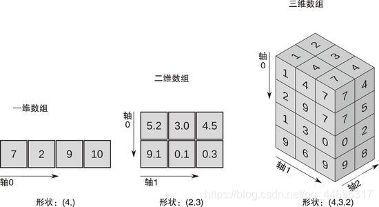
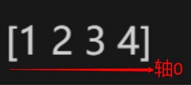
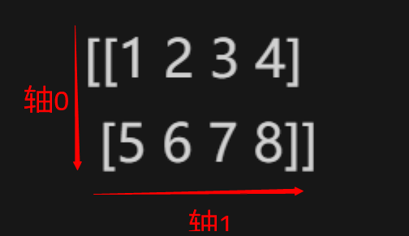
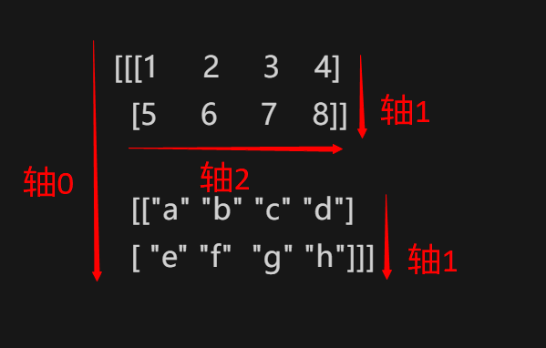
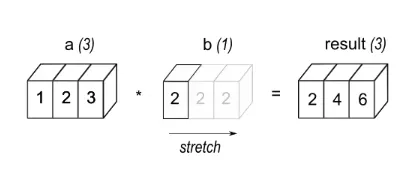
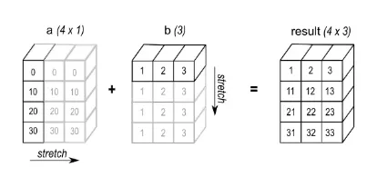

# 基本概念

## 图解












## 数组（ndarray）

1. **一维数组【列表】**

    类似列表，但数组切片针对原始数据

1. **二维数组（矩阵）【关于一维数组的列表】**

    以数组为元素的数组，包括行和列，类似表格

1. **三维数组（矩阵列表）【关于二维数组的列表】**
最常见的多维数组。指维数为3的数组结构，可用来描述三维空间中的位置或状态

2. **结构化数组**
用于处理异质数据的重要工具，通过定义复杂的数据类型，可以创建具有不同字段的数组，类似于表格或数据库中的行。结构化数组提供了访问、修改、排序和条件筛选数据的灵活性，同时也方便与 Pandas DataFrame 进行交互

## 轴（axis）

指定数组的某个轴可以沿该轴做相关操作（具体如上图）
对于一维数组，由于无法从上至下操作，因此其只有水平轴，即其轴0为水平轴（具体如上图）

## 广播机制（broadcast）







# 基础创建 

## array函数

`array（object, dtype=None, copy=True, ndmin=0, order="K", subok=False, like=None）`

1. **object**: 任何具有数组接口方法的对象（数组、列表、元组等，主要是列表和数组）

2. **dtype**: 数据类型。可以通过设置不同字段和数据类型以创建结构化数组

    dtype

        bool_(bool8、"?")【8位布尔类型】

        number

            integer

                signedinteger【有符号整数】

                    int64（intp、int0、longlong、"l"）【64位（-9223372036854775808~9223372036854775807）】

                    int32(int_、intc、"i")【32位】

                    int16(short、"h")【16位（-32768~32767）】

                    int8(byte、"b")【8位（-128~127）】

                    timedelta64【两个时间之间的间隔】

                unsignedinteger【无符号整数】

                    uint64(uintp、uint0、ulonglong)【64位（0~18446744073709551615）】

                    uint32(uint、uintc)【32位（0~4294967295）】

                    uint16(ushort)【16位（0~65535）】

                    uint8(ubyte)【8位（0~255）】

            inexact

                complexfloating

                    longcomplex(clongfloat、clongdouble)【两个128位浮点数】

                    complex_(complex128、cfloat、cdouble)【两个64位浮点数】

                    singlecomplex(csingle、complex64)【两个32位浮点数】

                floating

                    longfloat(longdouble、"g")【128位浮点数】

                    float64(float_、double、"d")【双精度浮点：1个符号位，11位指数，52位尾数】

                    float32(single、"f")【单精度浮点：1个符号位，8位指数，23位尾数】

                    float16(half)【半精度浮点：1个符号位，5位指数，10位尾数】

        flexible

            character

                string_(bytes_、bytes0)

                unicode_(str_、str0)

            void0(void)

        datetime64【日期时间类型】

        object_(object0、"O")【任何python对象】

1. **copy**: 是否复制原数组。默认为True

2. **ndmin**: 指定最小维度

3. subok: 是否从子类创建数组。默认为False，即强制创建基类数组

4. order: 元素在内存中的存储顺序，值为"K"、"A"、"C"、"F"
若object参数为非数组，其值可为"K"、"C"、"F"
若object参数为数组，其值均可取
"K": 元素在内存中出现的顺序
"A": 原顺序
"C": 按行
"F": 按列

5. like: 默认为None

```Python
# 简单创建
n0 = np.array([1, 2, 3, 4])       # 一维数组
"""
[1 2 3 4]
"""

n1 = np.array([[1, 2], [3, 4]])   # 二维数组
"""
[[1 2]
 [3 4]]
 """

n2 = np.array([[[1, 2, 3, 4], [5, 6, 7, 8]], [["a", "b", "c", "d"], ["e", "f", "g", "h"]]])    # 三维数组
"""
[[['1' '2' '3' '4']
  ['5' '6' '7' '8']]

 [['a' 'b' 'c' 'd']
  ['e' 'f' 'g' 'h']]]
"""


# 设置dtype
n3 = np.array([1, 2, 3, 4], dtype=np.float_)
print(n3, n3.dtype, type(n3[0]))
"""
[1. 2. 3. 4.] float64 <class 'numpy.float64'>
"""

n4 = np.array([1, 2, 3, 4], dtype=np.intp)
print(n4, n4.dtype, type(n4[0]))
"""
[1 2 3 4] int64 <class 'numpy.int64'>
"""

n5 = np.array([1, 2, 3, 4], dtype=np.complex_)
print(n5, n5.dtype, type(n5[0]))
"""
[1.+0.j 2.+0.j 3.+0.j 4.+0.j] complex128 <class 'numpy.complex128'>
"""


# 设置copy
n0 = np.array([1, 2, 3, 4])
n6 = np.array(n0, copy=True)    # 复制原数组，与原数组独立
n6[0] = 0
n0[1] = 20
print(n6, n0)
"""
[0 2 3 4] [ 1 20  3  4]
"""

n0 = np.array([1, 2, 3, 4])
n7 = np.array(n0, copy=False)   # 不复制原数组，与原数组关联
n7[0] = 0
n0[1] = 20
print(n7, n0)
"""
[ 0 20  3  4] [ 0 20  3  4]
"""


# 设置ndmin
n8 = np.array([[1, 2], [3, 4]], ndmin=2)    # 二维
"""
[[1 2]
 [3 4]]
"""

n9 = np.array([[1, 2], [3, 4]], ndmin=3)    # 三维
"""
[[[1 2]
  [3 4]]]
"""

# 结构化数组的创建
dtype = np.dtype([('name', 'S10'), ('age', int), ('height', float)])
data = np.array([('Alice', 25, 5.6), ('Bob', 30, 6.0)], dtype=dtype)
"""
[(b'Alice', 25, 5.6) (b'Bob', 30, 6. )]
"""

dtype_nested = np.dtype([('info', [('name', 'S10'), ('age', int)]), ('height', float)])
data_nested = np.array([(('Alice', 25), 5.6), (('Bob', 30), 6.0)], dtype=dtype_nested)
"""
[((b'Alice', 25), 5.6) ((b'Bob', 30), 6. )]
"""
```

# 填充创建

## empty函数

创建指定形状，未初始化的数组，元素为随机值

`empty(shape, dtype=numpy.float64, order="C", like=None)`

1. **shape**: 创建的数组的形状。可以是整数或整数序列

2. dtype: 同上。默认为numpy.float64

3. order: 同上。"C"和"F"可选，默认"C"

4. like: 默认为None

```Python
n10 = np.empty(5)
"""
[0.   0.25 0.5  0.75 1.  ]
"""

n11 = np.empty([4, 3])
"""
[[0. 0. 1.]
 [1. 1. 1.]
 [1. 1. 1.]
 [0. 0. 1.]]
"""
```

## zeros函数

创建指定形状，以0填充的数组

`zeros(shape, dtype=numpy.float64, order="C", like=None)`

1. **shape**: 同上

2. dtype: 同上

3. order: 同上

4. like: 默认为None

```Python
n12 = np.zeros(5)
"""
[0. 0. 0. 0. 0.]
"""

n13 = np.zeros([4, 3])
"""
[[0. 0. 0.]
 [0. 0. 0.]
 [0. 0. 0.]
 [0. 0. 0.]]
"""
```

## ones函数

创建指定形状，以1填充的数组

`ones(shape, dtype=numpy.float64, order="C", like=None)`

1. **shape**: 同上

2. dtype: 同上

3. order: 同上

4. like: 默认为None

```Python
n14 = np.ones(5)
"""
[1. 1. 1. 1. 1.]
"""

n15 = np.ones([4, 3])
"""
[[1. 1. 1.]
 [1. 1. 1.]
 [1. 1. 1.]
 [1. 1. 1.]]
"""
```

## full函数

创建指定形状，以fill_value填充的数组

`full(shape, fill_value, dtype=None, order="C", like=None)`

1. **shape**: 同上

2. **fill_value**: 指定填充值。可以是单一数值或数组等

3. dtype: 同上。默认为None，即与填充值类型一致

4. order: 同上

5. like: 默认为None

```Python
n16 = np.full(5, fill_value=8)
"""
[8 8 8 8 8]
"""

n17 = np.full([4, 3], fill_value=8)
"""
[[8 8 8]
 [8 8 8]
 [8 8 8]
 [8 8 8]]
"""

n18 = np.full([6, 4], fill_value=[1, 2, 3, 4])
"""
[[1 2 3 4]
 [1 2 3 4]
 [1 2 3 4]
 [1 2 3 4]
 [1 2 3 4]
 [1 2 3 4]]
"""

n18 = np.full([6, 4], fill_value=[[1], [2], [3], [4], [5], [6]])
"""
[[1 1 1 1]
 [2 2 2 2]
 [3 3 3 3]
 [4 4 4 4]
 [5 5 5 5]
 [6 6 6 6]]
"""
```

# 范围创建

## arange函数

类似于range函数，范围为**[start，stop)**，区别是该函数返回数组以及该函数参数可以为任意实数。建议该函数参数仅使用整数类型

`arange(start=0, stop, step=1, dtype=None, like=None)`

1. **start**: 起始值。可以是整数或实数。默认为0

2. **stop**: 终止值。可以是整数或实数

3. **step**: 步长或间隔。可以是整数或实数。默认为1

4. dtype: 同上。默认为None，自动判断数据类型

5. like: 默认为None

```Python
n19 = np.arange(10)
"""
[0 1 2 3 4 5 6 7 8 9]
"""

n20 = np.arange(1, 10)
"""
[1 2 3 4 5 6 7 8 9]
"""

n21 = np.arange(1, 10, 2)
"""
[1 3 5 7 9]
"""
```

## linspace函数

用于创建**等差数列**数组（在start和stop之间产生num个均匀等差数）

**当包含stop（默认）时，步长为（stop-start）/（num-1）；当不包含stop时，步长为（stop-start）/num**

`linspace(start, stop, num=50, endpoint=True, retstep=False, dtype=None, axis=0)`

1. **start**: 起始值。可以是任一实数或列表、数组等

2. **stop**: 终止值。可以是任一实数或列表、数组等

3. **num**: 产生样本的数量。默认为50

4. **endpoint**: 是否包含stop参数值。默认为True

5. **retstep**: 是否以元组的形式返回显示步长（等差）。默认为False

6. **axis**: 仅当start或stop为列表或数组等类型时有效。表示沿着该轴为等差数列。默认为0

7. dtype: 同上

```Python
# 简单创建
n22 = np.linspace(1, 10, 5)
"""
[ 1.    3.25  5.5   7.75 10.  ]
"""

n23 = np.linspace(1, [11, 12, 13, 14], 5)
"""
[[ 1.    1.    1.    1.  ]
 [ 3.5   3.75  4.    4.25]
 [ 6.    6.5   7.    7.5 ]
 [ 8.5   9.25 10.   10.75]
 [11.   12.   13.   14.  ]]
"""

n24 = np.linspace([1, 2, 3, 4], 11, 5)
"""
[[ 1.    2.    3.    4.  ]
 [ 3.5   4.25  5.    5.75]
 [ 6.    6.5   7.    7.5 ]
 [ 8.5   8.75  9.    9.25]
 [11.   11.   11.   11.  ]]
"""

n25 = np.linspace([1, 2, 3, 4], [11, 12, 13, 14], 5)
"""
[[ 1.   2.   3.   4. ]
 [ 3.5  4.5  5.5  6.5]
 [ 6.   7.   8.   9. ]
 [ 8.5  9.5 10.5 11.5]
 [11.  12.  13.  14. ]]
"""


# 设置endpoint
n26 = np.linspace(1, 10, 5, endpoint=False)
"""
[1.  2.8 4.6 6.4 8.2]
"""


# 设置retstep
n27 = np.linspace(1, 10, 5, retstep=True)
"""
(array([ 1.  ,  3.25,  5.5 ,  7.75, 10.  ]), 2.25)
"""


# 设置axis
n28 = np.linspace([1, 2, 3, 4], [11, 12, 13, 14], 6, axis=0)
"""
[[ 1.  2.  3.  4.]
 [ 3.  4.  5.  6.]
 [ 5.  6.  7.  8.]
 [ 7.  8.  9. 10.]
 [ 9. 10. 11. 12.]
 [11. 12. 13. 14.]]
"""

n29 = np.linspace([1, 2, 3, 4], [11, 12, 13, 14], 6, axis=1)
"""
[[ 1.  3.  5.  7.  9. 11.]
 [ 2.  4.  6.  8. 10. 12.]
 [ 3.  5.  7.  9. 11. 13.]
 [ 4.  6.  8. 10. 12. 14.]]
"""
```

## logspace函数

用于创建**等比数列**（在base**start和base**stop之间产生num个均匀等比数）

等比数列在对数上为等差数列，所以换种思路可理解为：**在start和stop之间生成num个均匀等差数列（同linspace函数），再将每个数以base为底作指数运算**

`logspace(start, stop, num=50, endpoint=True, base=10.0, dtype=None, axis=0)`

1. **start**: 同上。但初始值为base**start

2. **stop**: 同上。但终止值为base**stop

3. **num**: 同上

4. **endpoint**: 同上

5. **base**: 底数，可以为任一实数或列表、数组等。默认为10.0

6. **axis**: 仅当start、stop或base为列表或数组等类型时有效。表示沿着该轴为等比数列。默认为0

7. dtype: 同上

```Python
n30 = np.logspace(1, 10, 10, base=2)
"""
[   2.    4.    8.   16.   32.   64.  128.  256.  512. 1024.]
"""

n31 = np.logspace(1, 4, 5, base=[2, 3, 4, 5])
"""
[[  2.           3.           4.           5.        ]
 [  3.36358566   6.83852117  11.3137085   16.71850762]
 [  5.65685425  15.58845727  32.          55.90169944]
 [  9.51365692  35.53399835  90.50966799 186.91859765]
 [ 16.          81.         256.         625.        ]]
"""
```

# 随机创建

## random.rand函数

创建一个给定形状的数组，并用**[0，1)**上均匀分布的随机样本填充。若未给定参数，将仅返回一个随机数

`rand(d0, d1, ..., dn)`

```Python
n32 = np.random.rand()
"""
0.9470660042118693
"""

n33 = np.random.rand(3)
"""
[0.88734261 0.88303211 0.76045189]
"""

n34 = np.random.rand(3, 4)
"""
[[0.38775125 0.56929663 0.82186919 0.3899654 ]
 [0.31936881 0.02693    0.75568994 0.286433  ]
 [0.42836783 0.36534623 0.93650673 0.69723928]]
"""
```

## random.randn函数

创建一个给定形状的数组，从“**标准正态”分布（均值为0，标准差为1）**随机返回一个或多个样本
服从均值为μ，标准差为σ的正态分布，可用：**μ + σ * np.random.randn(...)**    来生成数组

`randn(d0, d1, ..., dn)`

```Python
n35 = np.random.randn()
"""
-0.9634996081712404
"""

n36 = np.random.randn(3)
"""
[0.5043878  0.86713589 0.27525007]
"""

n37 = np.random.randn(3, 4)
"""
[[-0.1079871  -0.42197777  0.52599791  0.17754496]
 [ 0.47036527 -0.90796359 -0.22122957 -0.50120022]
 [-0.47200183  0.59749017  1.08836655  0.67734795]]
"""
```

## random.randint函数

创建一个给定形状的数组，用**[low, high）的随机整数**样本填充；若**high未指定，范围为[0, low)的随机整数**

`randint(low, high=None, size=None, dtype=int)`

1. **low**: 起始值。可为整数或列表、数组等

2. **high**: 终止值。可为整数或列表、数组等

3. **size**: 指定数组形状大小。若不指定，则根据参数类型决定返回类型

4. dtype: 同上。默认为int

```Python
# high未指定，范围为[0, low)
n38 = np.random.randint(2, size=10)
"""
[1 0 1 0 0 0 1 1 1 0]
"""


# 指定high，范围为[low, high)
n39 = np.random.randint(1, 10, size=10)
"""
[7 1 6 7 6 7 5 9 1 6]
"""


# 未指定size，根据参数类型决定size
n40 = np.random.randint(1, 10)
"""
8
"""

n41 = np.random.randint(1, [10, 11, 12, 13])         # 范围分别为[1, 10)、[1, 11)、[1, 12)、[1, 13)
"""
[ 8 10 11  4]
"""

n42 = np.random.randint([1, 3, 5, 7], [[10], [20]])
"""
[[1 5 9 8]
 [2 8 8 7]]
"""


# 指定size
n43 = np.random.randint(1, 10, size=[3, 4])
"""
[[4 1 7 9]
 [8 2 1 4]
 [4 2 4 7]]
"""
```

## random.normal函数

创建一个给定形状的数组，从**正态分布（均值为loc，标准差为scale）**随机返回一个或多个样本

`normal(loc=0.0, scale=1.0, size=None)`

1. **loc**: 均值。可为浮点数或列表、数组等**。**默认为0.0

2. **scale**: 标准差。可为浮点数或列表、数组等,。默认为1.0

3. **size**: 同上

```Python
n44 = np.random.normal(loc=2, scale=2)
"""
1.8403874883934772
"""

n45 = np.random.normal(loc=2, scale=2, size=[3, 4])
"""
[[ 1.89492021  1.82202719  2.46348908 -1.21728651]
 [-3.10725159  3.67963494  8.82440607 -1.18438998]
 [ 4.22737934  1.88183014  1.90411906  0.04398211]]
"""
```

# 其它创建

## asarray函数

类似array函数，但默认不复制原数据；若设置了dtype，仅当所设置dtype与原数据不匹配时复制原数据

`asarray(a, dtype=None, order='K', like=None)`

1. **a**: 任何能转换为数组的对象

2. dtype: 同上

3. order: 同上

4. like: 同上

```Python
n0 = np.array([1, 2, 3, 4])
n46 = np.asarray(n0)
n0[0] = 10
n46[1] = 20
print(n46, n0)
"""
[10 20  3  4] [10 20  3  4]
"""

n0 = np.array([1, 2, 3, 4])
n47 = np.asarray(n0, dtype=np.float_)
n0[0] = 10
n47[1] = 20
print(n47, n0)
"""
[ 1. 20.  3.  4.] [10  2  3  4]
"""
```

## frombuffer函数

`frombuffer(buffer, count=-1, offset=0, dtype=None, like=None)`

1. **buffer**: 具有buffer接口的对象

2. **count**: 读取的数量。默认为-1，表示读取全部数据

3. **offset**: 偏移量。从此开始读取缓冲区(以字节为单位)。默认为0

4. dtype: 同上。默认为float

5. like: 同上

```Python
s = b'hello world'
n48 = np.frombuffer(s, count=3, offset=2, dtype="S1")
"""
[b'l' b'l' b'o']
"""
```

## fromiter函数

从可迭代对象创建数组

**`fromiter(iter, dtype, count=-1, like=None)`**

1. **iter**: 可迭代对象，如列表、元组等

2. **dtype**: 同上

3. **count**: 同上

4. like: 同上

```Python
n49 = np.fromiter([i for i in range(0, 10)], dtype=np.float_, count=6)
"""
[0. 1. 2. 3. 4. 5.]
"""
```

# like创建

该类创建函数类似于前述填充创建的函数，区别在于该类函数的形状由给定数组决定

## empty_like函数

创建一个与给定数组的维度和数据类型相同的未初始化的数组

`empty_like(prototype, dtype=None, order='K', subok=True, shape=None)`

1. **prototype**: 给定的数组

2. dtype: 覆盖结果的数据类型。同上

3. order: 覆盖结果的内存排列，默认为"K"。同上

4. subok: 同上。默认为True

5. shape: 覆盖结果的形状。同上

```Python
n50 = np.empty_like([[1, 2, 3, 4], [5, 6, 7, 8]])
"""
[[         0 1072693248          0 1077149696]
 [         0 1074266112          0 1074790400]]
"""
```

## zeros_like函数

创建一个与给定数组的维度和数据类型相同的以0填充的数组

`zeros_like(a, dtype=None, order='K', subok=True, shape=None)`

1. **a**: 给定的数组

2. dtype: 同上

3. order: 同上

4. subok: 同上

5. shape: 同上

```Python
n51 = np.zeros_like([[1, 2, 3, 4], [5, 6, 7, 8]])
"""
[[0 0 0 0]
 [0 0 0 0]]
"""
```

## ones_like函数

创建一个与给定数组的维度和数据类型相同的以1填充的数组

`ones_like(a, dtype=None, order='K', subok=True, shape=None)`

1. **a**: 给定的数组

2. dtype: 同上

3. order: 同上

4. subok: 同上

5. shape: 同上

```Python
n52 = np.ones_like([[1, 2, 3, 4], [5, 6, 7, 8]])
"""
[[1 1 1 1]
 [1 1 1 1]]
"""
```

## full_like函数

创建一个与给定数组的维度和数据类型相同的以fill_value填充的数组

`full_like(a, fill_value, dtype=None, order='K', subok=True, shape=None)`

1. **a**: 给定的数组

2. **fill_value**: 指定填充值。同上

3. dtype: 同上

4. order: 同上

5. subok: 同上

6. shape: 同上

```Python
n53 = np.full_like([[1, 2, 3, 4], [5, 6, 7, 8]], fill_value=10)
"""
[[10 10 10 10]
 [10 10 10 10]]
"""
```

# 对角创建

对于二维及以上数组才有对角线，一般只提二维数组

对于二维数组，其对角线是指**a[i, i+offset或k]**，offset或k是偏移量，当offset或k=0时，该对角线为主对角线，即**a[i, i]**，该对角线包含的元素包括a[0, 0], a[1, 1], ..., a[i, i]。

对于多维数组，其主对角线为**a[i, i, ..., i]**

## eye函数

创建一个**对角线(i, i+k)为1**，其它位置为0的二维数组

`eye(N, M=N, k=0, dtype=float, order='C', like=None)`

1. **N**: 行数

2. **M**: 列数。默认与N相等

3. **k**: 相对于主对角线的偏移量或者对角线索引。默认为0，即主对角线；+表示上方对角线，-表示下方对角线

4. dtype: 同上。默认为float

5. order: 同上。默认为"C"

6. like: 同上

```Python
n54 = np.eye(5)
"""
[[1. 0. 0. 0. 0.]
 [0. 1. 0. 0. 0.]
 [0. 0. 1. 0. 0.]
 [0. 0. 0. 1. 0.]
 [0. 0. 0. 0. 1.]]
"""

n55 = np.eye(5, 7)
"""
[[1. 0. 0. 0. 0. 0. 0.]
 [0. 1. 0. 0. 0. 0. 0.]
 [0. 0. 1. 0. 0. 0. 0.]
 [0. 0. 0. 1. 0. 0. 0.]
 [0. 0. 0. 0. 1. 0. 0.]]
"""

n56 = np.eye(5, 7, k=1)
"""
[[0. 1. 0. 0. 0. 0. 0.]
 [0. 0. 1. 0. 0. 0. 0.]
 [0. 0. 0. 1. 0. 0. 0.]
 [0. 0. 0. 0. 1. 0. 0.]
 [0. 0. 0. 0. 0. 1. 0.]]
"""

n57 = np.eye(5, 7, k=-1)
"""
[[0. 0. 0. 0. 0. 0. 0.]
 [1. 0. 0. 0. 0. 0. 0.]
 [0. 1. 0. 0. 0. 0. 0.]
 [0. 0. 1. 0. 0. 0. 0.]
 [0. 0. 0. 1. 0. 0. 0.]]
"""
```

## diag函数

提取一个二维数组的对角或者创建一个对角二维数组(对角为该一维数组)

`diag(v, k=0)`

1. **v**: 指定数组，只能是一维数组或二维数组

2. **k**: 同上

```Python
n0 = np.random.randint(1, 10, size=(5, 7))
"""
[[3 2 6 9 2 4 8]
 [7 4 1 4 7 4 2]
 [4 3 5 1 6 8 9]
 [2 6 9 2 2 3 7]
 [1 5 7 4 3 5 6]]
"""

n58 = np.diag(n0)
"""
[3 4 5 2 3]
"""

n1 = np.array([1, 2, 3, 4])
n59 = np.diag(n1)
"""
[[1 0 0 0]
 [0 2 0 0]
 [0 0 3 0]
 [0 0 0 4]]
"""
```

## diagflat函数

将数组转化为一维数组后，创建一个对角二维数组（对角为该转化后的一维数组）

`diagflat(v, k=0)`

1. **v**: 指定数组

2. **k**: 同上

```Python
n0 = np.array([1, 2, 3, 4])
n60 = np.diagflat(n0)
"""
[[1 0 0 0]
 [0 2 0 0]
 [0 0 3 0]
 [0 0 0 4]]
"""

n1 = np.array([[1, 2, 3, 4], [5, 6, 7, 8]])
n61 = np.diagflat(n1)
"""
[[1 0 0 0 0 0 0 0]
 [0 2 0 0 0 0 0 0]
 [0 0 3 0 0 0 0 0]
 [0 0 0 4 0 0 0 0]
 [0 0 0 0 5 0 0 0]
 [0 0 0 0 0 6 0 0]
 [0 0 0 0 0 0 7 0]
 [0 0 0 0 0 0 0 8]]
"""
```

# 对角三角创建

## tri函数

创建一个**对角线(i, i+k)及以下部分为1**，其它位置为0的二维数组

`tri(N, M=N, k=0, dtype=float, like=None)`

1. **N**: 行数

2. **M**: 列数。默认与N相等

3. **k**: 同上

4. dtype: 同上。默认为float

5. like: 同上

```Python
n62 = np.tri(5)
"""
[[1. 0. 0. 0. 0.]
 [1. 1. 0. 0. 0.]
 [1. 1. 1. 0. 0.]
 [1. 1. 1. 1. 0.]
 [1. 1. 1. 1. 1.]]
"""

n63 = np.tri(5, 7)
"""
[[1. 0. 0. 0. 0. 0. 0.]
 [1. 1. 0. 0. 0. 0. 0.]
 [1. 1. 1. 0. 0. 0. 0.]
 [1. 1. 1. 1. 0. 0. 0.]
 [1. 1. 1. 1. 1. 0. 0.]]
"""

n64 = np.tri(5, 7, k=1)
"""
[[1. 1. 0. 0. 0. 0. 0.]
 [1. 1. 1. 0. 0. 0. 0.]
 [1. 1. 1. 1. 0. 0. 0.]
 [1. 1. 1. 1. 1. 0. 0.]
 [1. 1. 1. 1. 1. 1. 0.]]
"""

n65 = np.tri(5, 7, k=-1)
"""
[[0. 0. 0. 0. 0. 0. 0.]
 [1. 0. 0. 0. 0. 0. 0.]
 [1. 1. 0. 0. 0. 0. 0.]
 [1. 1. 1. 0. 0. 0. 0.]
 [1. 1. 1. 1. 0. 0. 0.]]
"""
```

