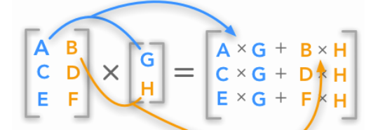
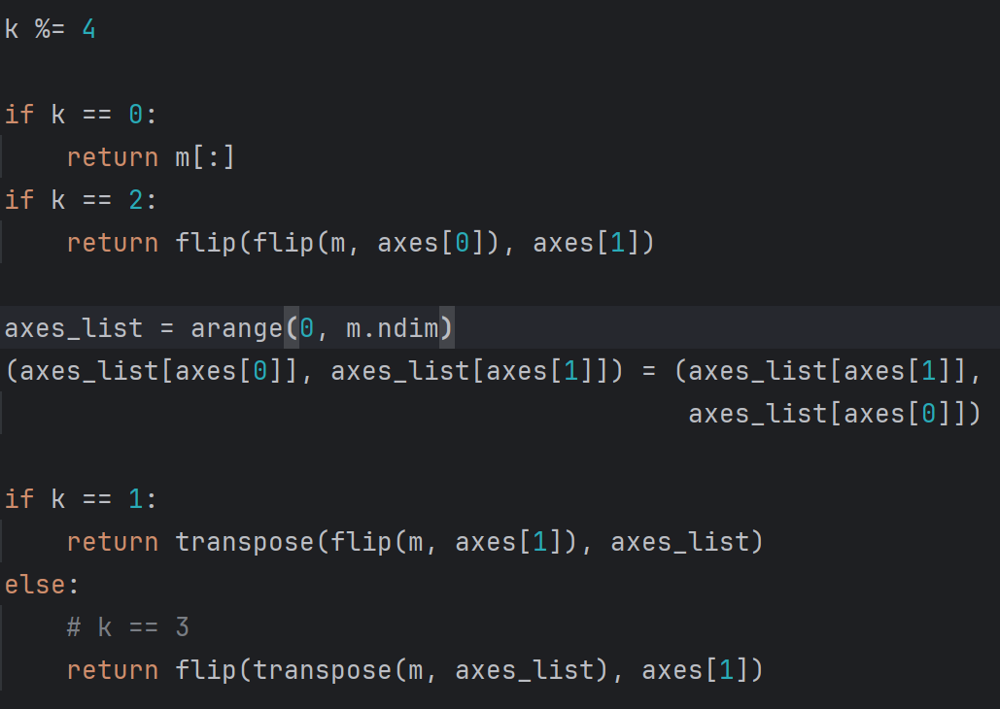

# 常数

1. 正无穷大: Inf、Infinity、PINF、infty、inf

2. 负无穷大: NINF

3. 非数字: NAN、NaN、nan

4. 正零: PZERO

5. 负零: NZERO

6. 自然常数e: e

7. 欧拉常数γ: euler_gamma

8. π: pi

9. None: newaxis，主要用于索引数组

```Python
print(np.Inf, np.Infinity, np.PINF, np.infty, np.inf)
"""
inf inf inf inf inf
"""

print(np.NINF)
"""
-inf
"""

print(np.NAN, np.NaN, np.nan)
"""
nan nan nan
"""

print(np.PZERO)
"""
0.0
"""

print(np.NZERO)
"""
-0.0
"""

print(np.e)
"""
2.718281828459045
"""

print(np.euler_gamma)
"""
0.5772156649015329
"""

print(np.pi)
"""
3.141592653589793
"""

print(np.newaxis)
"""
None
"""

n0 = np.array([1, 2, 3, 4])
print(n0[np.newaxis, :])
"""
[[1 2 3 4]]
"""

print(n0[np.newaxis])
"""
[[1 2 3 4]]
"""

print(n0[None])
"""
[[1 2 3 4]]
"""

print(n0[:, np.newaxis])
"""
[[1]
 [2]
 [3]
 [4]]
"""
```

# 类型转换

在上一节中关于dtype有详细介绍。其中的类型可以作为函数用于数据类型转换

```Python
n = 3.14
n_int8 = np.int8(n)
print(n_int8)
"""
3
"""

n_bool = np.bool_(n)
print(n_bool)
"""
True
"""
```

# 数组属性

1. **shape**: 形状

2. **dtype**: 数据类型

3. **ndim**: 维度

4. **base**: 基类数组

5. **flat**: 一维数组迭代器

6. **imag**:虚部

7. **real**: 实部

8. **size**: 总元素数=维数乘积

9. **itemsize**: 每个元素占的字节数

10. **nbytes**: 总元素字节数=size * itemsize

11. **strides**:每个维度上进入到下一个数需要跨越的字节数

12. **flags**: 内存布局信息

13. ctypes

14. data

```Python
n0 = np.arange(12)
print(n0)
"""
[ 0  1  2  3  4  5  6  7  8  9 10 11]
"""
n1 = n0.reshape(3, 4)
print(n1)
"""
[[ 0  1  2  3]
 [ 4  5  6  7]
 [ 8  9 10 11]]
"""

# shape属性: 形状
print(n1.shape)
"""
(3, 4)
"""

# dtype属性: 数据类型
print(n1.dtype)
"""
int32
"""

# ndim属性: 维度
print(n1.ndim)
"""
2
"""

# base属性: 基类数组
print(n1.base, n1.base is n0)
"""
[ 0  1  2  3  4  5  6  7  8  9 10 11] True
"""

# flat属性: 一维数组迭代器
print(n1.flat, np.array(n1.flat))
"""
<numpy.flatiter object at 0x000001F088E46760> [ 0  1  2  3  4  5  6  7  8  9 10 11]
"""

# imag属性:虚部
print(n1.imag)
"""
[[0 0 0 0]
 [0 0 0 0]
 [0 0 0 0]]
"""

# real属性: 实部
print(n1.real)
"""
[[ 0  1  2  3]
 [ 4  5  6  7]
 [ 8  9 10 11]]
"""

# size属性: 总元素数=维数乘积
print(n1.size)
"""
12
"""

# itemsize属性: 每个元素占的字节数
print(n1.itemsize)
"""
4
"""

# nbytes属性: 总元素字节数=size * itemsize
print(n1.nbytes)
"""
48
"""

# strides属性:每个维度上进入到下一个数需要跨越的字节数
print(n1.strides)
"""
(16, 4)
"""

# flags属性: 内存布局信息
print(n1.flags)
"""
  C_CONTIGUOUS : True
  F_CONTIGUOUS : False
  OWNDATA : False
  WRITEABLE : True
  ALIGNED : True
  WRITEBACKIFCOPY : False
"""

# ctypes属性
print(n1.ctypes)
"""
<numpy.core._internal._ctypes object at 0x00000203AF48EF00>
"""

# data属性
print(n1.data)
"""
<memory at 0x00000203AF4C0520>
"""
```

# 数组运算

## 加法运算（+、add函数）

```Python
n1 = np.array([1, 2, 3, 4])
n2 = np.array([5, 6, 7, 8])
n3 = np.array([[1], [5]])
n4 = np.array([[1, 2, 3, 4], [5, 6, 7, 8]])

print(n1 + n2)
"""
[ 6  8 10 12]
"""

print(n1 + n3)
"""
[[2 3 4 5]
 [6 7 8 9]]
"""

print(n1 + n4)
"""
[[ 2  4  6  8]
 [ 6  8 10 12]]
"""

print(n3 + n4)
"""
[[ 2  3  4  5]
 [10 11 12 13]]
"""

print(np.add(n3, n4))
"""
[[ 2  3  4  5]
 [10 11 12 13]]
"""
```

## 减法运算（-、subtract函数）

```Python
n1 = np.array([1, 2, 3, 4])
n2 = np.array([5, 6, 7, 8])
n3 = np.array([[1], [5]])
n4 = np.array([[1, 2, 3, 4], [5, 6, 7, 8]])

print(n1 - n2)
"""
[-4 -4 -4 -4]
"""

print(n1 - n3)
"""
[[ 0  1  2  3]
 [-4 -3 -2 -1]]
"""

print(n1 - n4)
"""
[[ 0  0  0  0]
 [-4 -4 -4 -4]]
"""

print(n3 - n4)
"""
[[ 0 -1 -2 -3]
 [ 0 -1 -2 -3]]
"""

print(np.subtract(n3, n4))
"""
[[ 0 -1 -2 -3]
 [ 0 -1 -2 -3]]
"""
```

## 乘法运算（*、multiply函数）

```Python
n1 = np.array([1, 2, 3, 4])
n2 = np.array([5, 6, 7, 8])
n3 = np.array([[1], [5]])
n4 = np.array([[1, 2, 3, 4], [5, 6, 7, 8]])

print(n1 * n2)
"""
[ 5 12 21 32]
"""

print(n1 * n3)
"""
[[ 1  2  3  4]
 [ 5 10 15 20]]
"""

print(n1 * n4)
"""
[[ 1  4  9 16]
 [ 5 12 21 32]]
"""

print(n3 * n4)
"""
[[ 1  2  3  4]
 [25 30 35 40]]
"""

print(np.multiply(n3, n4))
"""
[[ 1  2  3  4]
 [25 30 35 40]]
"""
```

## 除法运算（/、divide函数、true_divide函数）

```Python
n1 = np.array([1, 2, 3, 4])
n2 = np.array([5, 6, 7, 8])
n3 = np.array([[1], [5]])
n4 = np.array([[1, 2, 3, 4], [5, 6, 7, 8]])

print(n1 / n2)
"""
[0.2        0.33333333 0.42857143 0.5       ]
"""

print(n1 / n3)
"""
[[1.  2.  3.  4. ]
 [0.2 0.4 0.6 0.8]]
"""

print(n1 / n4)
"""
[[1.         1.         1.         1.        ]
 [0.2        0.33333333 0.42857143 0.5       ]]
"""

print(n3 / n4)
"""
[[1.         0.5        0.33333333 0.25      ]
 [1.         0.83333333 0.71428571 0.625     ]]
"""

print(np.divide(n3, n4))
"""
[[1.         0.5        0.33333333 0.25      ]
 [1.         0.83333333 0.71428571 0.625     ]]
"""

print(np.true_divide(n3, n4))
"""
[[1.         0.5        0.33333333 0.25      ]
 [1.         0.83333333 0.71428571 0.625     ]]
"""
```

## 整除（地板除）运算（//、floor_divide函数）

**满足a = a % b + b * (a // b)**

```Python
n1 = np.array([1, 2, 3, 4])
n2 = np.array([5, 6, 7, 8])
n3 = np.array([[1], [5]])
n4 = np.array([[1, 2, 3, 4], [5, 6, 7, 8]])

print(n1 // n2)
"""
[0 0 0 0]
"""

print(n1 // n3)
"""
[[1 2 3 4]
 [0 0 0 0]]
"""

print(n1 // n4)
"""
[[1 1 1 1]
 [0 0 0 0]]
"""

print(n3 // n4)
"""
[[1 0 0 0]
 [1 0 0 0]]
"""

print(np.floor_divide(n3, n4))
"""
[[1 0 0 0]
 [1 0 0 0]]
"""
```

## 取余（模）运算（%、remainder函数、mod函数、fmod函数、divmod函数）

1. %、remainder函数、mod函数: 满足**a = a % b + b * (a // b)**

2. fmod函数：结果**符号与被除数相同**。**|结果| = |a| % |b|**

3. divmod函数: 同时返回商与余数

```Python
n1 = np.array([1, -2, 3, -4])
n2 = np.array([5, -6, -7, 8])
n3 = np.array([[-1], [5]])
n4 = np.array([[1, -2, 3, -4], [-5, -6, -7, 8]])

print(n1 % n2)
"""
[ 1 -2 -4  4]
"""

print(n1 % n3)
"""
[[0 0 0 0]
 [1 3 3 1]]
"""

print(n1 % n4)
"""
[[ 0  0  0  0]
 [-4 -2 -4  4]]
"""

print(n3 % n4)
"""
[[ 0 -1  2 -1]
 [ 0 -1 -2  5]]
"""

print(np.remainder(n3, n4))
"""
[[ 0 -1  2 -1]
 [ 0 -1 -2  5]]
"""

print(np.mod(n3, n4))
"""
[[ 0 -1  2 -1]
 [ 0 -1 -2  5]]
"""

print(np.fmod(n3, n4))
"""
[[ 0 -1 -1 -1]
 [ 0  5  5  5]]
"""

print(np.divmod(n3, n4))
"""
(array([[-1,  0, -1,  0],
       [-1, -1, -1,  0]]), 
 array([[ 0, -1,  2, -1],
       [ 0, -1, -2,  5]]))
"""
```

## 点积运算（@、matmul函数、dot函数）

第一个数组列数必须与第二个数组的行数相同，对应行列乘积相加的结果为运算结果对应行列的元素

即形状为(m, k)的数组与形状为(k, n)的数组的点积结果为一个形状为(m, n)的数组

matmul函数支持广播机制，不支持标量乘法运算

dot函数不支持广播机制，支持标量乘法运算



1. 第一个数组若为一维，则其将被提升为二维，并视为二维数组的一行，结果仍为一维数组

2. 第二个数组若为一维，则其将被提升为二维，并视为二维数组的一列，结果仍为一维数组

```Python
n0 = np.array([1, 2, 3, 4])
print(n0)
"""
[1 2 3 4]
"""

n1 = np.array([5, 6, 7, 8])
print(n1)
"""
[5 6 7 8]
"""

n2 = np.arange(1, 17).reshape(4, 4)
print(n2)
"""
[[ 1  2  3  4]
 [ 5  6  7  8]
 [ 9 10 11 12]
 [13 14 15 16]]
"""

print(n0 @ n1)
"""
70
"""

print(n0 @ n2)
"""
[ 90 100 110 120]
"""

print(n2 @ n0)
"""
[ 30  70 110 150]
"""

print(n2 @ n2)
"""
[[ 90 100 110 120]
 [202 228 254 280]
 [314 356 398 440]
 [426 484 542 600]]
"""

print(np.matmul(n2, n2))
"""
[[ 90 100 110 120]
 [202 228 254 280]
 [314 356 398 440]
 [426 484 542 600]]
"""

print(np.dot(n2, n2))
"""
[[ 90 100 110 120]
 [202 228 254 280]
 [314 356 398 440]
 [426 484 542 600]]
"""

print(np.dot(n2, 3))
"""
[[ 3  6  9 12]
 [15 18 21 24]
 [27 30 33 36]
 [39 42 45 48]]
"""
```

## 乘方运算（**、power函数、float_power函数）

负数的非整数幂将返回nan

float_power函数与power函数的不同之处在于，整数、float16 和 float32 被提升为最小精度为 float64 的浮点数，因此结果总是不准确的

power函数不支持整数的负数幂

```Python
n1 = np.array([1, 2, 3, 4])
n2 = np.array([5, 6, 7, 8])
n3 = np.array([[1], [5]])
n4 = np.array([[1, 2, 3, 4], [5, 6, 7, 8]])

print(n1 ** n2)
"""
[    1    64  2187 65536]
"""

print(n1 ** n3)
"""
[[   1    2    3    4]
 [   1   32  243 1024]]
"""

print(n1 ** n4)
"""
[[    1     4    27   256]
 [    1    64  2187 65536]]
"""

print(n3 ** n4)
"""
[[     1      1      1      1]
 [  3125  15625  78125 390625]]
"""

print(np.power(n3, n4))
"""
[[     1      1      1      1]
 [  3125  15625  78125 390625]]
"""

print(np.power(-1, 1.5))
"""
imeWarning: invalid value encountered in power
  print(np.power(-1, 1.5))
nan
"""

print(np.float_power(1, -1))
"""
1.0
"""

print(type(np.power(2, 2)), type(np.float_power(2, 2)))
"""
<class 'numpy.int32'> <class 'numpy.float64'>
"""
```

## 比较运算

1. >: greater函数

2. >=: greater_equal函数

3. <: less函数

4. <=: less_equal函数

5. !=: not_equal函数

6. ==: equal函数

7. 最大值: maximum函数（二者之一为nan则返回nan）、fmax（二者之一为nan则返回非nan），二者均为nan则返回第一个元素（适用于复数，复数至少实部或虚部之一为nan即为nan）

8. 最小值: minimum函数（二者之一为nan则返回nan）、fmin（二者之一为nan则返回非nan），二者均为nan则返回第一个元素（适用于复数，复数至少实部或虚部之一为nan即为nan）

```Python
n1 = np.array([1, 2, 3, 4])
n2 = np.array([5, 6, 7, 8])
n3 = np.array([[1], [5]])
n4 = np.array([[1, 2, 3, 4], [5, 6, 7, 8]])

print(n1 >= n2)
"""
[False False False False]
"""

print(n1 >= n3)
"""
[[ True  True  True  True]
 [False False False False]]
"""

print(n1 >= n4)
"""
[[ True  True  True  True]
 [False False False False]]
"""

print(n3 >= n4)
"""
[[ True False False False]
 [ True False False False]]
"""

print(np.greater_equal(n3, n4))
"""
[[ True False False False]
 [ True False False False]]
"""

print(np.maximum(n3, n4))
"""
[[1 2 3 4]
 [5 6 7 8]]
"""

print(np.minimum(n3, n4))
"""
[[1 1 1 1]
 [5 5 5 5]]
"""

print(np.fmax(n3, n4))
"""
[[1 2 3 4]
 [5 6 7 8]]
"""

print(np.fmin(n3, n4))
"""
[[1 1 1 1]
 [5 5 5 5]]
"""
```

## 逻辑运算

1. 与运算: logical_and函数

2. 或运算: logical_or函数

3. 非运算: logical_not函数

4. 异或运算: logical_xor函数

```Python
n1 = np.array([1, 2, 3, 4])
n2 = np.array([5, 6, 7, 8])
n3 = np.array([[1], [5]])
n4 = np.array([[1, 2, 3, 4], [5, 6, 7, 8]])

print(np.logical_and(n1, n2))
"""
[ True  True  True  True]
"""

print(np.logical_and(n1, n3))
"""
[[ True  True  True  True]
 [ True  True  True  True]]
"""

print(np.logical_and(n1, n4))
"""
[[ True  True  True  True]
 [ True  True  True  True]]
"""

print(np.logical_and(n3, n4))
"""
[[ True  True  True  True]
 [ True  True  True  True]]
"""
```

## 按位运算

1. 与运算: &、bitwise_and函数

2. 或运算: |、bitwise_or函数

3. 异或运算: ^、bitwise_xor函数

4. 左移位运算: <<、left_shift函数

5. 右移位运算: >>、right_shift函数

6. 取反运算: ~、invert函数

```Python
n1 = np.array([1, 2, 3, 4])
n2 = np.array([5, 6, 7, 8])
n3 = np.array([[1], [5]])
n4 = np.array([[1, 2, 3, 4], [5, 6, 7, 8]])

print(n1 & n2)
"""
[1 2 3 0]
"""

print(n1 & n3)
"""
[[1 0 1 0]
 [1 0 1 4]]
"""

print(n1 & n4)
"""
[[1 2 3 4]
 [1 2 3 0]]
"""

print(n3 & n4)
"""
[[1 0 1 0]
 [5 4 5 0]]
"""

print(np.bitwise_and(n3, n4))
"""
[[1 0 1 0]
 [5 4 5 0]]
"""
```

## 标量运算

即与一个单独的数进行运算，数组中每个数据都与该数进行运算

```Python
n0 = np.array([[1, 2, 3, 4], [5, 6, 7, 8]])
print(n0 * 2)
"""
[[ 2  4  6  8]
 [10 12 14 16]]
"""

n1 = np.array([[1, 2, 3, 4], [5, 6, 7, 8]])
print(n1 > 2)
"""
[[False False  True  True]
 [ True  True  True  True]]
"""
```

# 数组索引与切片

类似列表、元组等，对于二维及以上数组有其独特的索引和切片方式，逐层索引
结构化数组的索引类似于字典

1. ndarray[n][m]...

2. ndarray[n, m, ...]

```Python
# 一维数组
n0 = np.arange(10)
print(n0)
"""
[0 1 2 3 4 5 6 7 8 9]
"""

print(n0[3])
"""
3
"""
print(n0[:4])
"""
[0 1 2 3]
"""

print(n0[2:])
"""
[2 3 4 5 6 7 8 9]
"""

print(n0[1:9:2])
"""
[1 3 5 7]
"""

print(n0[::-1])
"""
[9 8 7 6 5 4 3 2 1 0]
"""


# 二维数组
n1 = np.array([[1, 2, 3, 4], [5, 6, 7, 8]])
print(n1)
"""
[[1 2 3 4]
 [5 6 7 8]]
"""

print(n1[1])
"""
[5 6 7 8]
"""

print(n1[0][2])
"""
3
"""

print(n1[0][1:])
"""
[2 3 4]
"""

print(n1[1, ])
"""
[5 6 7 8]
"""

print(n1[0, 2])
"""
3
"""

print(n1[0, 1:])
"""
[2 3 4]
"""

print(n1[0:, 2:])
"""
[[3 4]
 [7 8]]
"""


# 三维数组
n2 = np.array([[[1, 2, 3, 4], [5, 6, 7, 8]], [["a", "b", "c", "d"], ["e", "f", "g", "h"]]])
print(n2)
"""
[[['1' '2' '3' '4']
  ['5' '6' '7' '8']]

 [['a' 'b' 'c' 'd']
  ['e' 'f' 'g' 'h']]]
"""

print(n2[1])
"""
[['a' 'b' 'c' 'd']
 ['e' 'f' 'g' 'h']]
"""

print(n2[0][1])
"""
['5' '6' '7' '8']
"""

print(n2[0][1][3])
"""
8
"""

print(n2[0][0][2:])
"""
['3' '4']
"""

print(n2[1, ])
"""
[['a' 'b' 'c' 'd']
 ['e' 'f' 'g' 'h']]
"""

print(n2[0, 1])
"""
['5' '6' '7' '8']
"""

print(n2[0, 1, 3])
"""
8
"""

print(n2[0:, 1:, 2:])
"""
[[['7' '8']]

 [['g' 'h']]]
"""


# 结构化数组
dtype = np.dtype([('name', 'S10'), ('age', int), ('height', float)])
data = np.array([('Alice', 25, 5.6), ('Bob', 30, 6.0)], dtype=dtype)
print(data)
"""
[(b'Alice', 25, 5.6) (b'Bob', 30, 6. )]
"""

print(data["name"])
"""
[b'Alice' b'Bob']
"""

print(data["age"])
"""
[25 30]
"""

print(data["height"])
"""
[5.6 6. ]
"""

print(data["height"][1:])
"""
[6.]
"""

print(data[data["age"] > 26])
"""
[(b'Bob', 30, 6.)]
"""

dtype_nested = np.dtype([('info', [('name', 'S10'), ('age', int)]), ('height', float)])
data_nested = np.array([(('Alice', 25), 5.6), (('Bob', 30), 6.0)], dtype=dtype_nested)
print(data_nested)
"""
[((b'Alice', 25), 5.6) ((b'Bob', 30), 6. )]
"""

print(data_nested["info"])
"""
[(b'Alice', 25) (b'Bob', 30)]
"""

print(data_nested["info"]["name"])
"""
[b'Alice' b'Bob']
"""

print(data_nested["info"]["age"])
"""
[25 30]
"""

print(data_nested["height"])
"""
[5.6 6. ]
"""

print(data_nested["height"][1:])
"""
[6.]
"""

print(data_nested[data_nested["info"]["age"] > 26])
"""
[((b'Bob', 30), 6.)]
"""
```

# 数组重塑(reshape)

即改变数组的形状，需注意**改变形状后的数组size必须与原数组size相同**

## reshape方法

`ndarray.reshape(shape, order='C')`

1. **shape**: 新形状，参数的元素可作为单独的参数传入

2. **order**: 读取及写入的顺序。可选"C"（按行，默认）、"F"（按列）

```Python
n0 = np.arange(12)
print(n0)
"""
[ 0  1  2  3  4  5  6  7  8  9 10 11]
"""

n1 = n0.reshape(3, 4)
print(n1)
"""
[[ 0  1  2  3]
 [ 4  5  6  7]
 [ 8  9 10 11]]
"""

n2 = n0.reshape([3, 4])
print(n2)
"""
[[ 0  1  2  3]
 [ 4  5  6  7]
 [ 8  9 10 11]]
"""

n3 = n0.reshape(3, 4, order="F")
print(n3)
"""
[[ 0  3  6  9]
 [ 1  4  7 10]
 [ 2  5  8 11]]
"""

n4 = n3.reshape(2, 6, order="C")
print(n4)
"""
[[ 0  3  6  9  1  4]
 [ 7 10  2  5  8 11]]
"""

n5 = n3.reshape(2, 6, order="F")
print(n5)
"""
[[ 0  2  4  6  8 10]
 [ 1  3  5  7  9 11]]
"""
```

## reshape函数

`reshape(a, newshape, order='C')`

1. **a**: 原数组

2. **newshape**: 同上，但参数的元素不可作为单独的参数传入

3. **order**: 同上

```Python
n0 = np.arange(12)
print(n0)
"""
[ 0  1  2  3  4  5  6  7  8  9 10 11]
"""

n6 = np.reshape(n0, [3, 4])
print(n6)
"""
[[ 0  1  2  3]
 [ 4  5  6  7]
 [ 8  9 10 11]]
"""
```

# 数组转置(transpose)

即行列转换

1. 一维数组转置后仍为原数组

2. 二维数组转置后即两个轴互换

3. 三维及以上数组转置可自定义轴的顺序

## T属性

`ndarray.T`

```Python
n0 = np.arange(12)
print(n0)
"""
[ 0  1  2  3  4  5  6  7  8  9 10 11]
"""

n1 = np.arange(12).reshape(3, 4)
print(n1)
"""
[[ 0  1  2  3]
 [ 4  5  6  7]
 [ 8  9 10 11]]
"""

n2 = n0.T
print(n2)
"""
[ 0  1  2  3  4  5  6  7  8  9 10 11]
"""

n3 = n1.T
print(n3)
"""
[[ 0  4  8]
 [ 1  5  9]
 [ 2  6 10]
 [ 3  7 11]]
"""
```

## transpose方法

`ndarray.transpose(*axes)`

1. **axes**: 即轴的顺序。轴i在第j个位置，表示将原数组的轴i变为转置数组的轴j。若未指定，则直接逆转轴的顺序

```Python
n0 = np.arange(12)
print(n0)
"""
[ 0  1  2  3  4  5  6  7  8  9 10 11]
"""

n1 = np.arange(12).reshape(3, 4)
print(n1)
"""
[[ 0  1  2  3]
 [ 4  5  6  7]
 [ 8  9 10 11]]
"""

n4 = n0.transpose()
print(n4)
"""
[ 0  1  2  3  4  5  6  7  8  9 10 11]
"""

n5 = n1.transpose()
print(n5)
"""
[[ 0  4  8]
 [ 1  5  9]
 [ 2  6 10]
 [ 3  7 11]]
"""

n6 = np.ones([3, 4, 5])    # 轴0大小为3，轴1大小为4， 轴2大小为5
print(n6, n6.shape)
"""
[[[1. 1. 1. 1. 1.]
  [1. 1. 1. 1. 1.]
  [1. 1. 1. 1. 1.]
  [1. 1. 1. 1. 1.]]

 [[1. 1. 1. 1. 1.]
  [1. 1. 1. 1. 1.]
  [1. 1. 1. 1. 1.]
  [1. 1. 1. 1. 1.]]

 [[1. 1. 1. 1. 1.]
  [1. 1. 1. 1. 1.]
  [1. 1. 1. 1. 1.]
  [1. 1. 1. 1. 1.]]] (3, 4, 5)
"""


n7 = n6.transpose(2, 0, 1)    # 轴2变轴0，现轴0大小为5；轴0变轴1，现轴1大小为3；轴1变轴2，现轴2大小为4
print(n7, n7.shape)
"""
[[[1. 1. 1. 1.]
  [1. 1. 1. 1.]
  [1. 1. 1. 1.]]

 [[1. 1. 1. 1.]
  [1. 1. 1. 1.]
  [1. 1. 1. 1.]]

 [[1. 1. 1. 1.]
  [1. 1. 1. 1.]
  [1. 1. 1. 1.]]

 [[1. 1. 1. 1.]
  [1. 1. 1. 1.]
  [1. 1. 1. 1.]]

 [[1. 1. 1. 1.]
  [1. 1. 1. 1.]
  [1. 1. 1. 1.]]] (5, 3, 4)
"""

n8 = n6.transpose()    # 直接逆转轴的顺序，轴2变轴0，轴1变轴1，轴0变轴2
print(n8, n8.shape)
"""
[[[1. 1. 1.]
  [1. 1. 1.]
  [1. 1. 1.]
  [1. 1. 1.]]

 [[1. 1. 1.]
  [1. 1. 1.]
  [1. 1. 1.]
  [1. 1. 1.]]

 [[1. 1. 1.]
  [1. 1. 1.]
  [1. 1. 1.]
  [1. 1. 1.]]

 [[1. 1. 1.]
  [1. 1. 1.]
  [1. 1. 1.]
  [1. 1. 1.]]

 [[1. 1. 1.]
  [1. 1. 1.]
  [1. 1. 1.]
  [1. 1. 1.]]] (5, 4, 3)
"""
```

## transpose函数

`transpose(a, axes=None)`

1. **a**: 原数组

2. **axes**: 同上

```Python
n0 = np.arange(12)
print(n0)
"""
[ 0  1  2  3  4  5  6  7  8  9 10 11]
"""

n1 = np.arange(12).reshape(3, 4)
print(n1)
"""
[[ 0  1  2  3]
 [ 4  5  6  7]
 [ 8  9 10 11]]
"""

n9 = np.transpose(n0)
print(n9)
"""
[ 0  1  2  3  4  5  6  7  8  9 10 11]
"""

n10 = np.transpose(n1)
print(n10)
"""
[[ 0  4  8]
 [ 1  5  9]
 [ 2  6 10]
 [ 3  7 11]]
"""

n11 = np.transpose(np.ones([3, 4, 5]), axes=[2, 0, 1])
print(n11, n11.shape)
"""
[[[1. 1. 1. 1.]
  [1. 1. 1. 1.]
  [1. 1. 1. 1.]]

 [[1. 1. 1. 1.]
  [1. 1. 1. 1.]
  [1. 1. 1. 1.]]

 [[1. 1. 1. 1.]
  [1. 1. 1. 1.]
  [1. 1. 1. 1.]]

 [[1. 1. 1. 1.]
  [1. 1. 1. 1.]
  [1. 1. 1. 1.]]

 [[1. 1. 1. 1.]
  [1. 1. 1. 1.]
  [1. 1. 1. 1.]]] (5, 3, 4)
"""
```

# 数组拼接

## concatenate函数

`concatenate(arrays, axis=0, out=None, dtype=None, casting="same_kind")`

1. **arrays**: **维度（ndim）相同**的数组序列。这些数组除了指定axis方向，其它轴方向上大小必须相同

2. **axis**: 沿该**已有的轴**进行拼接，不会产生新的轴。默认为0。若axis为None，则所有数组将被视为一维数组

3. out: 放置结果的目标数组。形状必须与拼接后数组的形状匹配。out数组的数据类型决定输出结果的数据类型

4. dtype: 数据类型。同上。不能与out参数同时提供

5. casting: 控制可能发生的数据转换类型。可选'no'、'equiv'、'safe'、'same_kind'（默认）、'unsafe'

```Python
# 二维数组
n0 = np.array([[1, 2, 3, 4]])
n1 = np.array([[11, 12, 13, 14], [15, 16, 17, 18]])
n2 = np.concatenate([n0, n1], axis=0)
print(n2)
"""
[[ 1  2  3  4]
 [11 12 13 14]
 [15 16 17 18]]
"""

n3 = np.array([[1, 2, 3, 4, 5], [5, 6, 7, 8, 9]])
n4 = np.array([[11, 12, 13, 14], [15, 16, 17, 18]])
n5 = np.concatenate([n3, n4], axis=1)
print(n5)
"""
[[ 1  2  3  4  5 11 12 13 14]
 [ 5  6  7  8  9 15 16 17 18]]
"""

n6 = np.array([[1, 2, 3, 4, 5], [5, 6, 7, 8, 9]])
n7 = np.array([[11, 12, 13, 14], [15, 16, 17, 18]])
n8 = np.concatenate([n6, n7], axis=None)
print(n8)
"""
[ 1  2  3  4  5  5  6  7  8  9 11 12 13 14 15 16 17 18]
"""

n9 = np.array([[1, 2, 3, 4, 5], [5, 6, 7, 8, 9]])
n10 = np.array([[11, 12, 13, 14], [15, 16, 17, 18]])
n11 = np.concatenate([n9, n10], axis=1, out=np.ones([2, 9]))
print(n11)
"""
[[ 1.  2.  3.  4.  5. 11. 12. 13. 14.]
 [ 5.  6.  7.  8.  9. 15. 16. 17. 18.]]
"""


# 一维数组
n12 = np.array([1, 2, 3, 4])
n13 = np.array([11, 12, 13, 14])
n14 = np.concatenate([n12, n13], axis=0)    # 注意只有轴0，且为一维数组的已有轴0
print(n14)
"""
[ 1  2  3  4 11 12 13 14]
"""
n15 = np.array([[1, 2, 3, 4]])
n16 = np.array([[11, 12, 13, 14]])
n17 = np.concatenate([n15, n16], axis=0)    # 均为二维数组的一行而非一维数组，轴0为二维数组的轴0
print(n17)
"""
[[ 1  2  3  4]
 [11 12 13 14]]
"""
```

## vstack（row_stack）函数：轴0(垂直)方向

`vstack(tup, dtype=None, casting="same_kind")`

<=>`concatenate(arrays, axis=0)`（一维数组因无垂直方向，需转化为一行二维数组）

1. **tup**: 数组序列。这些数组除了轴0方向，其它轴方向上大小必须相同（注意一维数组轴的区别）

2. dtype: 同上

3. casting: 同上

```Python
n18 = np.array([1, 2, 3, 4])
n19 = np.array([[11, 12, 13, 14], [15, 16, 17, 18]])
n20 = np.vstack([n18, n19])
print(n20)
"""
[[ 1  2  3  4]
 [11 12 13 14]
 [15 16 17 18]]
"""
```

## hstack函数：轴1(水平)方向

`hstack(tup, dtype=None, casting="same_kind")`

一维数组: <=>`concatenate(arrays, axis=0)`

二维及以上数组: <=>`concatenate(arrays, axis=1)`

1. **tup**: 同上。这些数组除了轴1方向，其它轴方向上大小必须相同（注意一维数组轴的区别）

2. dtype: 同上

3. casting: 同上

```Python
n21 = np.array([[1, 2, 3, 4, 5], [5, 6, 7, 8, 9]])
n22 = np.array([[11, 12, 13, 14], [15, 16, 17, 18]])
n23 = np.hstack([n21, n22])
print(n23)
"""
[[ 1  2  3  4  5 11 12 13 14]
 [ 5  6  7  8  9 15 16 17 18]]
"""
```

## dstack函数：轴2方向

`dstack(tup, dtype=None, casting="same_kind")`

<=>`concatenate(arrays, axis=2)`（只有三维数组有轴2，均需转换为三维数组）

1. **tup**: 同上。这些数组除了轴2方向，其它轴方向上大小必须相同（注意一维数组轴的区别）

2. dtype: 同上

3. casting: 同上

```Python
n24 = np.array([1, 2, 3, 4])
n25 = np.array([11, 12, 13, 14])
n26 = np.dstack([n24, n25])
print(n26)
"""
[[[ 1 11]
  [ 2 12]
  [ 3 13]
  [ 4 14]]]
"""

n27 = np.array([[1, 2, 3, 4], [5, 6, 7, 8]])
n28 = np.array([[11, 12, 13, 14], [15, 16, 17, 18]])
n29 = np.dstack([n27, n28])
print(n29)
"""
[[[ 1 11]
  [ 2 12]
  [ 3 13]
  [ 4 14]]

 [[ 5 15]
  [ 6 16]
  [ 7 17]
  [ 8 18]]]
"""
```

## column_stack函数

一维数组将被转变为一列二维数组，然后进行水平拼接

`column_stack(tup)`

1. **tup**: 同上。注意垂直方向上大小匹配

```Python
n30 = np.array([1, 2, 3, 4])
n31 = np.array([11, 12, 13, 14])
n32 = np.column_stack([n30, n31])
print(n32)
"""
[[ 1 11]
 [ 2 12]
 [ 3 13]
 [ 4 14]]
"""

n33 = np.array([[1, 2, 3, 4], [5, 6, 7, 8]])
n34 = np.array([[11, 12, 13, 14], [15, 16, 17, 18]])
n35 = np.column_stack([n33, n34])
print(n35)
"""
[[ 1  2  3  4 11 12 13 14]
 [ 5  6  7  8 15 16 17 18]]
"""

n36 = np.array([1, 2])
n37 = np.array([[11, 12, 13, 14], [15, 16, 17, 18]])
n38 = np.column_stack([n36, n37])
print(n38)
"""
[[ 1 11 12 13 14]
 [ 2 15 16 17 18]]
"""
```

# 数组堆叠

## stack函数

`stack(arrays, axis=0, out=None, dtype=None, casting="same_kind")`

1. **arrays**: **形状相同**的数组序列。这些数组形状必须相同，因所沿的轴为一个新轴

2. **axis**: 指定新轴的索引，并沿该**新轴**进行堆叠。默认为0

3. out: 同上

4. dtype: 同上

5. casting: 同上

```Python
# 一维数组
n39 = np.array([1, 2, 3, 4])
n40 = np.array([11, 12, 13, 14])
n41 = np.stack([n39, n40], axis=0)    # 新轴为轴0（此时注意是二维数组的轴0），原轴0变为轴1，沿轴0堆叠
print(n41)
"""
[[ 1  2  3  4]
 [11 12 13 14]]
"""

n42 = np.stack([n39, n40], axis=1)    # 新轴为轴1，原轴0仍为轴0（此时注意是二维数组的轴0），沿轴1堆叠
print(n42)
"""
[[ 1 11]
 [ 2 12]
 [ 3 13]
 [ 4 14]]
"""


# 二维数组
n43 = np.array([[1, 2, 3, 4], [5, 6, 7, 8]])
n44 = np.array([[11, 12, 13, 14], [15, 16, 17, 18]])
n45 = np.stack([n43, n44], axis=0)    # 新轴为轴0，原轴0变为轴1，原轴1变为轴2，沿轴0堆叠
print(n45)
"""
[[[ 1  2  3  4]
  [ 5  6  7  8]]

 [[11 12 13 14]
  [15 16 17 18]]]
"""

n46 = np.stack([n43, n44], axis=1)    # 新轴为轴1，原轴0仍为轴0，原轴1变为轴2，沿轴0堆叠
print(n46)
"""
[[[ 1  2  3  4]
  [11 12 13 14]]

 [[ 5  6  7  8]
  [15 16 17 18]]]
"""

n47 = np.stack([n43, n44], axis=2)    # 新轴为轴2，原轴0仍为轴0，原轴1仍为轴1，沿轴2堆叠
print(n47)
"""
[[[ 1 11]
  [ 2 12]
  [ 3 13]
  [ 4 14]]

 [[ 5 15]
  [ 6 16]
  [ 7 17]
  [ 8 18]]]
"""
```

# 数组拆分

## split函数

`split(ary, indices_or_sections, axis=0)`

1. **ary**: 待拆分的数组

2. **indices_or_sections**: 整数或列表、数组等。如果是一个整数N，将沿轴拆分成N个相等大小的数组，若不能相等将报错；如果为列表、数组等，元素表示拆分的位置，如[2, 3]表示拆分为ary[:2]、ary[2:3]、ary[3:]，若超出索引将返回一个空的子数组

3. **axis**: 拆分时沿的轴。默认为0

```Python
n0 = np.arange(15)
print(n0)
"""
[ 0  1  2  3  4  5  6  7  8  9 10 11 12 13 14]
"""

n1 = np.split(n0, 5)
print(n1)
"""
[array([0, 1, 2]), array([3, 4, 5]), array([6, 7, 8]), array([ 9, 10, 11]), array([12, 13, 14])]
"""

n2 = np.split(n0, [3, 6, 7, 18])
print(n2)
"""
[array([0, 1, 2]), array([3, 4, 5]), array([6]), array([ 7,  8,  9, 10, 11, 12, 13, 14]), array([], dtype=int32)]
"""

n3 = np.arange(24).reshape([4, 6])
print(n3)
"""
[[ 0  1  2  3  4  5]
 [ 6  7  8  9 10 11]
 [12 13 14 15 16 17]
 [18 19 20 21 22 23]]
"""

n4 = np.split(n3, 2, axis=0)
print(n4)
"""
[array([[ 0,  1,  2,  3,  4,  5],
       [ 6,  7,  8,  9, 10, 11]]), 
 array([[12, 13, 14, 15, 16, 17],
       [18, 19, 20, 21, 22, 23]])]
"""

n5 = np.split(n3, 2, axis=1)
print(n5)
"""
[array([[ 0,  1,  2],
       [ 6,  7,  8],
       [12, 13, 14],
       [18, 19, 20]]), 
 array([[ 3,  4,  5],
       [ 9, 10, 11],
       [15, 16, 17],
       [21, 22, 23]])]
"""
```

## vsplit函数：轴0方向或垂直方向

**仅用于二维及以上数组**

`vsplit(ary, indices_or_sections)`

<=>`split(ary, indices_or_sections, axis=0)`

```Python
n6 = np.arange(24).reshape([4, 6])
print(n6)
"""
[[ 0  1  2  3  4  5]
 [ 6  7  8  9 10 11]
 [12 13 14 15 16 17]
 [18 19 20 21 22 23]]
"""

n7 = np.vsplit(n6, 2)
print(n7)
"""
[array([[ 0,  1,  2,  3,  4,  5],
       [ 6,  7,  8,  9, 10, 11]]), 
 array([[12, 13, 14, 15, 16, 17],
       [18, 19, 20, 21, 22, 23]])]
"""
```

## hsplit函数：轴1方向或水平方向

**一维数组沿轴0方向，二维及以上数组沿轴1方向**

`hsplit(ary, indices_or_sections)`

一维数组：<=>`split(ary, indices_or_sections, axis=0)`

二维及以上数组：<=>`split(ary, indices_or_sections, axis=1)`

```Python
n8 = np.arange(15)
print(n8)
"""
[ 0  1  2  3  4  5  6  7  8  9 10 11 12 13 14]
"""

n9 = np.hsplit(n8, 5)
print(n9)
"""
[array([0, 1, 2]), array([3, 4, 5]), array([6, 7, 8]), array([ 9, 10, 11]), array([12, 13, 14])]
"""

n01 = np.arange(24).reshape([4, 6])
print(n10)
"""
[[ 0  1  2  3  4  5]
 [ 6  7  8  9 10 11]
 [12 13 14 15 16 17]
 [18 19 20 21 22 23]]
"""

n11 = np.hsplit(n10, 2)
print(n11)
"""
[array([[ 0,  1,  2],
       [ 6,  7,  8],
       [12, 13, 14],
       [18, 19, 20]]), 
 array([[ 3,  4,  5],
       [ 9, 10, 11],
       [15, 16, 17],
       [21, 22, 23]])]
"""
```

## dsplit函数：轴2方向

**仅用于三维及以上数组**

`dsplit(ary, indices_or_sections)`

<=>`split(ary, indices_or_sections, axis=2)`

```Python
n12 = np.arange(16).reshape([2, 2, 4])
print(n12)
"""
[[[ 0  1  2  3]
  [ 4  5  6  7]]

 [[ 8  9 10 11]
  [12 13 14 15]]]
"""

n13 = np.dsplit(n12, 2)
print(n13)
"""
[array([[[ 0,  1],
        [ 4,  5]],

       [[ 8,  9],
        [12, 13]]]), 
 array([[[ 2,  3],
        [ 6,  7]],

       [[10, 11],
        [14, 15]]])]
"""
```

## array_split函数

与split函数类似，区别是当不能分成相等大小的子数组时不会报错

`array_split(ary, indices_or_sections, axis=0)`

1. **ary**: 同上

2. **indices_or_sections**: 同上。在某一轴上，长度为L，拆分成N个部分，返回L%N个该轴上长度为L//N+1的子数组，其余子数组该轴上长度为L//N

3. **axis**: 同上

```Python
n14 = np.arange(15)
print(n14)
"""
[ 0  1  2  3  4  5  6  7  8  9 10 11 12 13 14]
"""

n15 = np.array_split(n14, 4)    #15%4=3个长度为15//4+1=4的子数组和4-3=1个长度为15//4=3的子数组
print(n15)
"""
[array([0, 1, 2, 3]), array([4, 5, 6, 7]), array([ 8,  9, 10, 11]), array([12, 13, 14])]
"""
```

# 数组删除

简单的方式可通过索引和切片选取所需数组或元素即可

## delete函数

返回一个数组，该数组删除了原数组沿指定轴指定索引的数组

`delete(arr, obj, axis=None)`

1. **arr**: 待删除数据的数组

2. **obj**: 指定沿axis要删除的索引

3. **axis**: 指定删除时所沿的轴。若axis为None，则将数组整体视为一维数组，返回结果也为一维数组

```Python
n0 = np.array([[1, 2, 3, 4], [5, 6, 7, 8], [11, 12, 13, 14], [15, 16, 17, 18]])
print(n0)
"""
[[ 1  2  3  4]
 [ 5  6  7  8]
 [11 12 13 14]
 [15 16 17 18]]
"""

n1 = np.delete(n0, 1, axis=0)    # 删除第2行
print(n1)
"""
[[ 1  2  3  4]
 [11 12 13 14]
 [15 16 17 18]]
"""

n2 = np.delete(n0, 1, axis=1)    # 删除第2列
print(n2)
"""
[[ 1  3  4]
 [ 5  7  8]
 [11 13 14]
 [15 17 18]]
"""

n3 = np.delete(n0, [0, 2], axis=1)    # 删除第1和第3列
print(n3)
"""
[[ 2  4]
 [ 6  8]
 [12 14]
 [16 18]]
"""

n4 = np.delete(n0, [1, 3, 5, 7], axis=None)    # 删除第2、4、6、8个
print(n4)
"""
[ 1  3  5  7 11 12 13 14 15 16 17 18]
"""
```

# 数组修改

直接索引或切片后赋值即可

```Python
n0 = np.arange(12).reshape(3, 4)
print(n0)
"""
[[ 0  1  2  3]
 [ 4  5  6  7]
 [ 8  9 10 11]]
"""

n0[2] = 20
print(n0)
"""
[[ 0  1  2  3]
 [ 4  5  6  7]
 [20 20 20 20]]
"""

n0[1, 2] = 60
print(n0)
"""
[[ 0  1  2  3]
 [ 4  5 60  7]
 [20 20 20 20]]
"""

n0[:2, 2:] = [[20, 30], [600, 70]]
print(n0)
"""
[[  0   1  20  30]
 [  4   5 600  70]
 [ 20  20  20  20]]
"""
```

# 数组查询

## where函数

`where(condition, x=None, y=None)`

1. **condition**: 条件。当只有该参数时，结果返回满足条件的元素数组元组

2. **x**: 单一值或数组。条件为True的值用x或x中对应的值替换。遵循广播机制

3. **y**: 单一数值或数组。条件为False的值用y或y中对应的值替换。遵循广播机制

```Python
n0 = np.arange(12)
print(n0)
"""
[ 0  1  2  3  4  5  6  7  8  9 10 11]
"""

n1 = np.where(n0 >= 5)
print(n1)
"""
(array([ 5,  6,  7,  8,  9, 10, 11], dtype=int64),)
"""

n1 = np.where(n0 >= 5, n0, n0+5)
print(n1)
"""
[ 5  6  7  8  9  5  6  7  8  9 10 11]
"""

n2 = np.where(n0 >= 5, 1, 0)
print(n2)
"""
[0 0 0 0 0 1 1 1 1 1 1 1]
"""

n3 = np.array([[0], [1], [2]])
print(n3)
"""
[[0]
 [1]
 [2]]
"""

n4 = np.array([0, 1, 2, 3])
print(n4)
"""
[0 1 2 3]
"""

n5 = np.where(n3 < n4, 2 * n3, 10 + n4)
print(n5)
"""
[[10  0  0  0]
 [10 11  2  2]
 [10 11 12  4]]
"""
```

# 对角提取

至少是二维数组

二维数组：直接提取对角，即a[i, i+offset]（注意轴的改变）

多维数组：先根据axis1和axis2提取出多个二维数组，再提取每个二维数组的对角

## diagonal方法

`ndarray.diagonal(offset=0, axis1=0, axis2=1)`

1. **offset**: 相对于主对角线的偏移量或者对角线索引。默认为0，即主对角线；+表示上方对角线，-表示下方对角线

2. **axis1**: 作为提取出的二维数组的轴0

3. **axis2**: 作为提取出的二维数组的轴1

```Python
# 二维数组
n0 = np.random.randint(1, 10, size=(5, 9))
print(n0)
"""
[[3 4 9 9 5 7 9 3 4]
 [3 7 1 5 8 6 2 5 9]
 [8 2 5 3 8 1 7 6 7]
 [3 5 4 2 3 5 5 2 6]
 [5 8 1 4 6 7 1 5 1]]
"""

n1 = n0.diagonal()
print(n1)
"""
[3 7 5 2 6]
"""

n2 = n0.diagonal(offset=1)
print(n2)
"""
[4 1 3 3 7]
"""

n3 = n0.diagonal(offset=-1)
print(n3)
"""
[3 2 4 4]
"""

n4 = n0.diagonal(offset=1, axis1=0, axis2=1)
print(n4)
"""
[4 1 3 3 7]
"""

n5 = n0.diagonal(offset=1, axis1=1, axis2=0)
print(n5)
"""
[3 2 4 4]
"""


# 三维数组
n6 = np.random.randint(1, 10, size=(3, 4, 5))
print(n6)
"""
[[[4 9 6 8 8]
  [4 6 3 4 4]
  [6 8 4 2 7]
  [3 3 6 8 5]]

 [[8 3 1 8 6]
  [1 6 5 1 1]
  [9 1 3 1 4]
  [7 3 5 8 8]]

 [[1 1 4 1 7]
  [2 1 6 3 6]
  [4 5 6 9 9]
  [1 5 5 7 4]]]
"""

n7 = n6.diagonal(axis1=2, axis2=1)
print(n7)
"""
[[4 6 4 8]
 [8 6 3 8]
 [1 1 6 7]]
"""
```

## diagonal函数

`diagonal(a, offset=0, axis1=0, axis2=1)`

1. **a**: 待提取的数组，至少为二维数组

2. **offset**: 同上

3. **axis1**: 同上

4. **axis2**: 同上

```Python
# 二维数组
n8 = np.random.randint(1, 10, size=(5, 9))
print(n8)
"""
[[7 4 3 7 1 2 3 1 4]
 [7 1 9 1 1 9 8 3 4]
 [3 8 4 8 2 8 3 4 4]
 [2 3 9 2 2 3 1 5 1]
 [5 5 2 2 7 4 9 7 3]]
"""

n9 = np.diagonal(n8)
print(n9)
"""
[7 1 4 2 7]
"""


# 三维数组
n10 = np.random.randint(1, 10, size=(3, 4, 5))
print(n10)
"""
[[[2 2 9 2 6]
  [2 2 4 5 5]
  [9 2 1 5 3]
  [8 5 7 3 9]]

 [[3 4 4 1 4]
  [4 9 5 9 7]
  [5 8 6 4 1]
  [9 6 6 3 2]]

 [[2 1 1 6 3]
  [4 6 6 4 7]
  [8 9 2 5 9]
  [1 8 7 8 9]]]
"""

n11 = np.diagonal(n10, axis1=2, axis2=1)
print(n11)
"""
[[2 2 1 3]
 [3 9 6 3]
 [2 6 2 8]]
"""
```

## diag函数

见数组的对角创建

# 对角修改

## fill_diagonal函数

**主对角线**a[i, i, ..., i]被修改为val，无返回值，**直接修改原数组**

`fill_diagonal(a, val, wrap=False)`

1. **a**: 待修改数组，至少是二维数组。对于**多维数组，每个维度上大小必需都相同**

2. **val**: 如果val是单一数值，该值沿着主对角线重复写入；如果为数组，该数组被转化为一维数组后重复写入主对角线

3. **wrap**: 溢出是否换行（一般只有高的二维数组会溢出）。默认为False

```Python
# 二维数组
n0 = np.zeros([10, 5])
print(n0)
"""
[[0. 0. 0. 0. 0.]
 [0. 0. 0. 0. 0.]
 [0. 0. 0. 0. 0.]
 [0. 0. 0. 0. 0.]
 [0. 0. 0. 0. 0.]
 [0. 0. 0. 0. 0.]
 [0. 0. 0. 0. 0.]
 [0. 0. 0. 0. 0.]
 [0. 0. 0. 0. 0.]
 [0. 0. 0. 0. 0.]]
"""

np.fill_diagonal(n0, 5)
print(n0)
"""
[[5. 0. 0. 0. 0.]
 [0. 5. 0. 0. 0.]
 [0. 0. 5. 0. 0.]
 [0. 0. 0. 5. 0.]
 [0. 0. 0. 0. 5.]
 [0. 0. 0. 0. 0.]
 [0. 0. 0. 0. 0.]
 [0. 0. 0. 0. 0.]
 [0. 0. 0. 0. 0.]
 [0. 0. 0. 0. 0.]]
"""

np.fill_diagonal(n0, [1, 2, 3])
print(n0)
"""
[[1. 0. 0. 0. 0.]
 [0. 2. 0. 0. 0.]
 [0. 0. 3. 0. 0.]
 [0. 0. 0. 1. 0.]
 [0. 0. 0. 0. 2.]
 [0. 0. 0. 0. 0.]
 [0. 0. 0. 0. 0.]
 [0. 0. 0. 0. 0.]
 [0. 0. 0. 0. 0.]
 [0. 0. 0. 0. 0.]]
"""

np.fill_diagonal(n0, [[5, 6], [7, 8]])
print(n0)
"""
[[5. 0. 0. 0. 0.]
 [0. 6. 0. 0. 0.]
 [0. 0. 7. 0. 0.]
 [0. 0. 0. 8. 0.]
 [0. 0. 0. 0. 5.]
 [0. 0. 0. 0. 0.]
 [0. 0. 0. 0. 0.]
 [0. 0. 0. 0. 0.]
 [0. 0. 0. 0. 0.]
 [0. 0. 0. 0. 0.]]
"""

np.fill_diagonal(n0, 5, wrap=True)
print(n0)
"""
[[5. 0. 0. 0. 0.]
 [0. 5. 0. 0. 0.]
 [0. 0. 5. 0. 0.]
 [0. 0. 0. 5. 0.]
 [0. 0. 0. 0. 5.]
 [0. 0. 0. 0. 0.]
 [5. 0. 0. 0. 0.]
 [0. 5. 0. 0. 0.]
 [0. 0. 5. 0. 0.]
 [0. 0. 0. 5. 0.]]
"""


# 三维数组
n1 = np.zeros([4, 4, 4])
print(n1)
"""
[[[0. 0. 0. 0.]
  [0. 0. 0. 0.]
  [0. 0. 0. 0.]
  [0. 0. 0. 0.]]

 [[0. 0. 0. 0.]
  [0. 0. 0. 0.]
  [0. 0. 0. 0.]
  [0. 0. 0. 0.]]

 [[0. 0. 0. 0.]
  [0. 0. 0. 0.]
  [0. 0. 0. 0.]
  [0. 0. 0. 0.]]

 [[0. 0. 0. 0.]
  [0. 0. 0. 0.]
  [0. 0. 0. 0.]
  [0. 0. 0. 0.]]]
"""

np.fill_diagonal(n1, 5)
print(n1)
"""
[[[5. 0. 0. 0.]
  [0. 0. 0. 0.]
  [0. 0. 0. 0.]
  [0. 0. 0. 0.]]

 [[0. 0. 0. 0.]
  [0. 5. 0. 0.]
  [0. 0. 0. 0.]
  [0. 0. 0. 0.]]

 [[0. 0. 0. 0.]
  [0. 0. 0. 0.]
  [0. 0. 5. 0.]
  [0. 0. 0. 0.]]

 [[0. 0. 0. 0.]
  [0. 0. 0. 0.]
  [0. 0. 0. 0.]
  [0. 0. 0. 5.]]]
"""
```

# 对角三角提取

一维数组：先扩展为轴0和轴1相同大小的二维数组，再提取提取指定对角线以上或以下部分

二维数组：提取指定对角线以上或以下部分，其余部分为0

多维数组：以最后两个轴提取出多个二维数组，再提取每个二维数组指定对角线以上或以下部分

## tril函数：对角线以下(lower)

`tril(m, k=0)`

1. **m**: 待提取数组

2. **k**: 同offset

```Python
# 一维数组
n0 = np.arange(1, 10)
print(n0)
"""
[1 2 3 4 5 6 7 8 9]
"""

n1 = np.tril(n0)
print(n1)
"""
[[1 0 0 0 0 0 0 0 0]
 [1 2 0 0 0 0 0 0 0]
 [1 2 3 0 0 0 0 0 0]
 [1 2 3 4 0 0 0 0 0]
 [1 2 3 4 5 0 0 0 0]
 [1 2 3 4 5 6 0 0 0]
 [1 2 3 4 5 6 7 0 0]
 [1 2 3 4 5 6 7 8 0]
 [1 2 3 4 5 6 7 8 9]]
"""


# 二维数组
n2 = np.random.randint(1, 10, size=(4, 5))
print(n2)
"""
[[4 3 2 9 1]
 [2 3 1 9 7]
 [8 9 3 4 1]
 [7 4 6 7 5]]
"""

n3 = np.tril(n2)
print(n3)
"""
[[4 0 0 0 0]
 [2 3 0 0 0]
 [8 9 3 0 0]
 [7 4 6 7 0]]
"""


# 三维数组
n4 = np.random.randint(1, 10, size=(4, 5, 6))
print(n4)
"""
[[[3 6 8 8 4 5]
  [4 8 1 8 5 3]
  [7 1 7 7 6 8]
  [7 5 7 4 4 6]
  [4 2 1 5 9 5]]

 [[5 8 6 1 1 5]
  [7 5 1 7 4 5]
  [4 9 2 9 1 3]
  [9 4 3 5 4 5]
  [7 3 7 2 6 4]]

 [[9 9 7 4 1 7]
  [9 4 4 9 7 8]
  [5 8 4 9 7 4]
  [7 7 2 9 3 9]
  [5 2 8 1 9 1]]

 [[6 7 8 8 7 7]
  [9 9 5 1 5 3]
  [7 3 3 9 8 1]
  [7 3 1 2 4 9]
  [7 1 9 9 7 8]]]
"""

n5 = np.tril(n4)
print(n5)
"""
[[[3 0 0 0 0 0]
  [4 8 0 0 0 0]
  [7 1 7 0 0 0]
  [7 5 7 4 0 0]
  [4 2 1 5 9 0]]

 [[5 0 0 0 0 0]
  [7 5 0 0 0 0]
  [4 9 2 0 0 0]
  [9 4 3 5 0 0]
  [7 3 7 2 6 0]]

 [[9 0 0 0 0 0]
  [9 4 0 0 0 0]
  [5 8 4 0 0 0]
  [7 7 2 9 0 0]
  [5 2 8 1 9 0]]

 [[6 0 0 0 0 0]
  [9 9 0 0 0 0]
  [7 3 3 0 0 0]
  [7 3 1 2 0 0]
  [7 1 9 9 7 0]]]
"""
```

## triu函数：对角线以上(upper)

`triu(m, k=0)`

1. **m**: 待提取数组

2. **k**: 同offset

```Python
# 一维数组
n5 = np.arange(1, 10)
print(n5)
"""
[1 2 3 4 5 6 7 8 9]
"""

n6 = np.triu(n5)
print(n6)
"""
[[1 2 3 4 5 6 7 8 9]
 [0 2 3 4 5 6 7 8 9]
 [0 0 3 4 5 6 7 8 9]
 [0 0 0 4 5 6 7 8 9]
 [0 0 0 0 5 6 7 8 9]
 [0 0 0 0 0 6 7 8 9]
 [0 0 0 0 0 0 7 8 9]
 [0 0 0 0 0 0 0 8 9]
 [0 0 0 0 0 0 0 0 9]]
"""


# 二维数组
n7 = np.random.randint(1, 10, size=(4, 5))
print(n7)
"""
[[3 9 7 8 5]
 [5 1 6 8 4]
 [1 6 8 8 1]
 [6 5 6 9 3]]
"""

n8 = np.triu(n7)
print(n8)
"""
[[3 9 7 8 5]
 [0 1 6 8 4]
 [0 0 8 8 1]
 [0 0 0 9 3]]
"""


# 三维数组
n9 = np.random.randint(1, 10, size=(4, 5, 6))
print(n9)
"""
[[[3 7 9 2 5 3]
  [6 5 3 1 7 7]
  [2 1 8 8 8 1]
  [3 1 6 6 5 4]
  [6 4 3 8 2 9]]

 [[2 5 7 1 6 9]
  [8 8 5 6 4 8]
  [8 5 7 5 1 8]
  [9 9 7 2 5 6]
  [2 2 8 2 7 4]]

 [[7 9 1 4 8 3]
  [2 1 9 6 5 6]
  [8 5 8 2 9 7]
  [5 1 5 6 6 8]
  [5 5 7 3 5 2]]

 [[3 5 9 6 2 3]
  [1 8 6 2 9 4]
  [3 5 1 4 4 5]
  [2 6 7 9 8 4]
  [7 4 4 2 5 3]]]
"""

n10 = np.triu(n9)
print(n10)
"""
[[[3 7 9 2 5 3]
  [0 5 3 1 7 7]
  [0 0 8 8 8 1]
  [0 0 0 6 5 4]
  [0 0 0 0 2 9]]

 [[2 5 7 1 6 9]
  [0 8 5 6 4 8]
  [0 0 7 5 1 8]
  [0 0 0 2 5 6]
  [0 0 0 0 7 4]]

 [[7 9 1 4 8 3]
  [0 1 9 6 5 6]
  [0 0 8 2 9 7]
  [0 0 0 6 6 8]
  [0 0 0 0 5 2]]

 [[3 5 9 6 2 3]
  [0 8 6 2 9 4]
  [0 0 1 4 4 5]
  [0 0 0 9 8 4]
  [0 0 0 0 5 3]]]
"""
```

# 数组翻转/旋转

## flip函数

逆转数组沿着指定轴元素的顺序，即m[..., **::-1**, ...]

`flip(m, axis=None)`

1. **m**: 待翻转数组

2. **axis**: 指定轴，可以是一条轴也可以是多条轴。默认是None，将翻转数组的所有轴

```Python
n0 = np.random.randint(1, 10, size=(3, 4, 5))
print(n0)
"""
[[[1 7 8 7 7]
  [6 2 8 8 3]
  [8 1 1 5 1]
  [1 8 4 8 9]]

 [[2 3 3 2 5]
  [2 2 3 1 4]
  [8 6 3 5 6]
  [4 1 6 2 2]]

 [[8 2 1 4 2]
  [4 1 7 8 2]
  [9 5 2 7 3]
  [1 8 4 5 1]]]
"""

n1 = np.flip(n0)
print(n1)
"""
[[[1 5 4 8 1]
  [3 7 2 5 9]
  [2 8 7 1 4]
  [2 4 1 2 8]]

 [[2 2 6 1 4]
  [6 5 3 6 8]
  [4 1 3 2 2]
  [5 2 3 3 2]]

 [[9 8 4 8 1]
  [1 5 1 1 8]
  [3 8 8 2 6]
  [7 7 8 7 1]]]
"""

n2 = np.flip(n0, axis=0)
print(n2)
"""
[[[8 2 1 4 2]
  [4 1 7 8 2]
  [9 5 2 7 3]
  [1 8 4 5 1]]

 [[2 3 3 2 5]
  [2 2 3 1 4]
  [8 6 3 5 6]
  [4 1 6 2 2]]

 [[1 7 8 7 7]
  [6 2 8 8 3]
  [8 1 1 5 1]
  [1 8 4 8 9]]]
"""

n3 = np.flip(n0, axis=1)
print(n3)
"""
[[[1 8 4 8 9]
  [8 1 1 5 1]
  [6 2 8 8 3]
  [1 7 8 7 7]]

 [[4 1 6 2 2]
  [8 6 3 5 6]
  [2 2 3 1 4]
  [2 3 3 2 5]]

 [[1 8 4 5 1]
  [9 5 2 7 3]
  [4 1 7 8 2]
  [8 2 1 4 2]]]
"""

n4 = np.flip(n0, axis=2)
print(n4)
"""
[[[7 7 8 7 1]
  [3 8 8 2 6]
  [1 5 1 1 8]
  [9 8 4 8 1]]

 [[5 2 3 3 2]
  [4 1 3 2 2]
  [6 5 3 6 8]
  [2 2 6 1 4]]

 [[2 4 1 2 8]
  [2 8 7 1 4]
  [3 7 2 5 9]
  [1 5 4 8 1]]]
"""

n5 = np.flip(n0, axis=(1, 2))
print(n5)
"""
[[[9 8 4 8 1]
  [1 5 1 1 8]
  [3 8 8 2 6]
  [7 7 8 7 1]]

 [[2 2 6 1 4]
  [6 5 3 6 8]
  [4 1 3 2 2]
  [5 2 3 3 2]]

 [[1 5 4 8 1]
  [3 7 2 5 9]
  [2 8 7 1 4]
  [2 4 1 2 8]]]
"""

n6 = n0[:, ::-1, ::-1]    # 与n5等价
print(n6)
"""
[[[9 8 4 8 1]
  [1 5 1 1 8]
  [3 8 8 2 6]
  [7 7 8 7 1]]

 [[2 2 6 1 4]
  [6 5 3 6 8]
  [4 1 3 2 2]
  [5 2 3 3 2]]

 [[1 5 4 8 1]
  [3 7 2 5 9]
  [2 8 7 1 4]
  [2 4 1 2 8]]]
"""
```

## fliplr函数

将数组（至少是二维数组）沿**轴1**（二维：left/right）翻转

`fliplr(m)`

<=>`flip(m, axis=1)`

<=>`m[:, ::-1]`

```Python
n0 = np.random.randint(1, 10, size=(3, 4, 5))
print(n0)
"""
[[[1 4 5 2 3]
  [7 3 7 8 9]
  [2 1 6 3 7]
  [9 6 3 1 1]]

 [[7 9 2 4 7]
  [3 5 9 3 8]
  [9 9 6 5 2]
  [8 9 1 8 2]]

 [[9 9 1 7 6]
  [7 1 2 8 5]
  [8 1 2 2 4]
  [4 5 6 2 4]]]
"""

n7 = np.fliplr(n0)
print(n7)
"""
[[[9 6 3 1 1]
  [2 1 6 3 7]
  [7 3 7 8 9]
  [1 4 5 2 3]]

 [[8 9 1 8 2]
  [9 9 6 5 2]
  [3 5 9 3 8]
  [7 9 2 4 7]]

 [[4 5 6 2 4]
  [8 1 2 2 4]
  [7 1 2 8 5]
  [9 9 1 7 6]]]
"""
```

## flipud函数

将数组（至少是一维数组）沿**轴0**（二维：up/down）翻转

`flipud(m)`

<=>`flip(m, axis=0)`

<=>`m[::-1, ...]`

```Python
n0 = np.random.randint(1, 10, size=(3, 4, 5))
print(n0)
"""
[[[4 5 1 2 6]
  [8 7 4 8 9]
  [9 9 2 8 2]
  [5 3 7 9 8]]

 [[3 8 5 3 2]
  [4 2 3 2 3]
  [2 5 7 3 6]
  [8 3 9 9 3]]

 [[9 2 7 7 2]
  [8 3 6 6 2]
  [1 8 6 1 1]
  [3 9 5 2 6]]]
"""

n8 = np.flipud(n0)
print(n8)
"""
[[[9 2 7 7 2]
  [8 3 6 6 2]
  [1 8 6 1 1]
  [3 9 5 2 6]]

 [[3 8 5 3 2]
  [4 2 3 2 3]
  [2 5 7 3 6]
  [8 3 9 9 3]]

 [[4 5 1 2 6]
  [8 7 4 8 9]
  [9 9 2 8 2]
  [5 3 7 9 8]]]
"""
```

## rot90函数

将数组（至少是二维数组）从第一个轴向第二个轴旋转k个90°。多维数组即将多维数组中有指定两个轴的二维数组进行旋转

`rot90(m, k=1, axes=(0, 1))`

1. **m**: 待旋转数组

2. **k**: 旋转次数

3. **axes**: 轴序列。**必须且只能是指定两个轴，并且两个轴必须不同**。



```Python
n0 = np.random.randint(1, 10, size=(3, 4))
print(n0)
"""
[[7 6 1 6]
 [2 7 9 5]
 [2 8 7 4]]
"""

n9 = np.rot90(n0)
print(n9)
"""
[[6 5 4]
 [1 9 7]
 [6 7 8]
 [7 2 2]]
"""

n10 = np.rot90(n0, k=2)
print(n10)
"""
[[4 7 8 2]
 [5 9 7 2]
 [6 1 6 7]]
"""

n11 = np.rot90(n0, axes=(1, 0))
print(n11)
"""
[[2 2 7]
 [8 7 6]
 [7 9 1]
 [4 5 6]]
"""

n12 = np.random.randint(1, 10, size=(3, 4, 5))
print(n12)
"""
[[[4 9 8 3 8]
  [6 2 3 8 1]
  [7 9 5 3 8]
  [1 5 6 5 7]]

 [[8 5 1 7 4]
  [5 3 4 4 1]
  [4 6 3 2 1]
  [5 3 8 8 7]]

 [[1 8 2 2 3]
  [9 1 9 2 4]
  [2 1 3 9 5]
  [3 5 5 8 5]]]
"""

n13 = np.rot90(n12, axes=(1, 2))
print(n13)
"""
[[[8 1 8 7]
  [3 8 3 5]
  [8 3 5 6]
  [9 2 9 5]
  [4 6 7 1]]

 [[4 1 1 7]
  [7 4 2 8]
  [1 4 3 8]
  [5 3 6 3]
  [8 5 4 5]]

 [[3 4 5 5]
  [2 2 9 8]
  [2 9 3 5]
  [8 1 1 5]
  [1 9 2 3]]]
"""
```

# 数组排序

## sort方法、函数

`ndarray.sort(axis=-1, kind=None, order=None)`
`sort(a, axis=-1, kind=None, order=None)`
sort方法对原数组进行排序，而sort函数返回排序后的副本

1. **a**: 待排序的数组

2. **axis**: 排序指定的轴。默认为-1，即对最后一个轴进行排序。若为None，则将数组视为一维数组进行排序

3. kind: 排序算法。可选'quicksort'（默认）、'mergesort'、 'heapsort'、 'stable'

4. **order**: 指定排序的字段。适用于结构化数组。当指定多个字段时，若前一个字段排序时相同，再根据后一个字段进行排序

```Python
n0 = np.random.randint(1, 17, size=(2, 2, 4))
print(n0)
"""
[[[16  3  2 11]
  [16  3  8 11]]

 [[ 5  5  2 11]
  [14  8  8  9]]]
"""

n0.sort()
print(n0)
"""
[[[ 2  3 11 16]
  [ 3  8 11 16]]

 [[ 2  5  5 11]
  [ 8  8  9 14]]]
"""

n0 = np.random.randint(1, 17, size=(2, 2, 4))
print(n0)
"""
[[[ 1  7  4 11]
  [ 8 12  5 11]]

 [[11  8  4 11]
  [ 9 12  5 13]]]
"""

n2 = np.sort(n0)
print(n2)
"""
[[[ 1  4  7 11]
  [ 5  8 11 12]]

 [[ 4  8 11 11]
  [ 5  9 12 13]]]
"""

n3 = np.sort(n0, axis=0)
print(n3)
"""
[[[ 1  7  4 11]
  [ 8 12  5 11]]

 [[11  8  4 11]
  [ 9 12  5 13]]]
"""

n4 = np.sort(n0, axis=1)
print(n4)
"""
[[[ 1  7  4 11]
  [ 8 12  5 11]]

 [[ 9  8  4 11]
  [11 12  5 13]]]
"""

n5 = np.sort(n0, axis=2)
print(n5)
"""
[[[ 1  4  7 11]
  [ 5  8 11 12]]

 [[ 4  8 11 11]
  [ 5  9 12 13]]]
"""

n6 = np.sort(n0, axis=None)
print(n6)
"""
[ 1  4  4  5  5  7  8  8  9 11 11 11 11 12 12 13]
"""


dtype = [('name', 'S10'), ('height', float), ('age', int)]
values = [('Arthur', 1.8, 41), ('Lancelot', 1.9, 38), ('Galahad', 1.7, 38)]
n7 = np.array(values, dtype=dtype)
print(n7)
"""
[(b'Arthur', 1.8, 41) (b'Lancelot', 1.9, 38) (b'Galahad', 1.7, 38)]
"""

print(np.sort(n7, order='height'))
"""
[(b'Galahad', 1.7, 38) (b'Arthur', 1.8, 41) (b'Lancelot', 1.9, 38)]
"""

print(np.sort(n7, order=['age', 'height']))
"""
[(b'Galahad', 1.7, 38) (b'Lancelot', 1.9, 38) (b'Arthur', 1.8, 41)]
"""
```

## argsort方法、函数

返回排序后的各元素在原数组中沿指定轴的位置，但实际并不对数组进行排序

`ndarray.argsort(axis=-1, kind=None, order=None)`
`argsort(a, axis=-1, kind=None, order=None)`

1. **a**: 同上

2. **axis**: 同上

3. kind: 同上

4. **order**: 同上

```Python
n0 = np.random.randint(1, 17, size=(2, 2, 4))
print(n0)
"""
[[[ 6  5  6  7]
  [16 10  9  1]]

 [[ 1 11  9  9]
  [12  3  8  6]]]
"""

n1 = n0.argsort()
print(n1)
"""
[[[1 0 2 3]
  [3 2 1 0]]

 [[0 2 3 1]
  [1 3 2 0]]]
"""

n2 = np.argsort(n0)
print(n2)
"""
[[[1 0 2 3]
  [3 2 1 0]]

 [[0 2 3 1]
  [1 3 2 0]]]
"""

n3 = np.argsort(n0, axis=0)
print(n3)
"""
[[[1 0 0 0]
  [1 1 1 0]]

 [[0 1 1 1]
  [0 0 0 1]]]
"""

n4 = np.argsort(n0, axis=1)
print(n4)
"""
[[[0 0 0 1]
  [1 1 1 0]]

 [[0 1 1 1]
  [1 0 0 0]]]
"""

n5 = np.argsort(n0, axis=2)
print(n5)
"""
[[[1 0 2 3]
  [3 2 1 0]]

 [[0 2 3 1]
  [1 3 2 0]]]
"""

n6 = np.argsort(n0, axis=None)
print(n6)
"""
[ 7  8 13  1  0  2 15  3 14  6 10 11  5  9 12  4]
"""

dtype = [('name', 'S10'), ('height', float), ('age', int)]
values = [('Arthur', 1.8, 41), ('Lancelot', 1.9, 38), ('Galahad', 1.7, 38)]
n7 = np.array(values, dtype=dtype)
print(n7)
"""
[(b'Arthur', 1.8, 41) (b'Lancelot', 1.9, 38) (b'Galahad', 1.7, 38)]
"""

print(np.argsort(n7, order='height'))
"""
[2 0 1]
"""

print(np.argsort(n7, order=['age', 'height']))
"""
[2 1 0]
"""
```

## lexsort函数

`lexsort(keys, axis=-1)`
若为多个一维数组，先根据最后一个数组进行排序，当出现相同时根据前一个数组进行排序，以此类推，返回排序后的索引
若为一个二维数组，先根据最后一行排序，当出现相同时根据上一行进行排序，以此类推，返回排序后的索引
若为多个二维数组，则每次根据axis从每个数组中取出一个一维数组后，彼此之间进行排序，返回排序后的索引组合

1. **keys**: 排序数组。若有多个数组，则每个数组必须是相同形状。默认最后一个数组作为初始排序数组。

2. **aixs**: 若为多个二维数组，取出一维数组所沿的轴。默认为-1，即使用最后一个轴（1）

```Python
n0 = np.random.randint(1, 17, size=6)
print(n0)
"""
[ 3 15 13 16  9 13]
"""

n1 = np.random.randint(1, 17, size=6)
print(n1)
"""
[ 4 13  7 16 15  1]
"""

n2 = np.random.randint(1, 17, size=6)
print(n2)
"""
[15 12  5 13  7  7]
"""

n3 = np.lexsort((n0, n1, n2))
print(n3)
"""
[2 5 4 1 3 0]
"""

n4 = np.random.randint(1, 17, size=(4, 4))
print(n4)
"""
[[ 7  4 10 12]
 [15 12 12  8]
 [ 8  9 14  3]
 [ 5  2 16  1]]
"""

n5 = np.lexsort(n4)
print(n5)
"""
[3 1 0 2]
"""

n6 = np.random.randint(1, 17, size=(3, 4))
"""
[[16  2  9  5]
 [ 3  2  6  8]
 [ 1 12 11 14]]
"""

n7 = np.random.randint(1, 17, size=(3, 4))
"""
[[10  7 16 12]
 [ 7  1  5 11]
 [ 9  7  9 16]]
"""

n8 = np.lexsort((n6, n7), axis=1)
"""
[[1 0 3 2]
 [1 2 0 3]
 [1 0 2 3]]
"""

n9 = np.lexsort((n6, n7), axis=0)
"""
[[1 1 1 1]
 [2 0 2 0]
 [0 2 0 2]]
"""
```

# 数组一维化

## flatten方法

返回一个连续的一维（扁平）数组

`ndarray.flatten(order="C")`

```Python
n0 = np.array([[1, 2, 3], [4, 5, 6], [7, 8, 9]])
"""
[[1 2 3]
 [4 5 6]
 [7 8 9]]
"""

n1 = n0.flatten(order="C")
"""
[1 2 3 4 5 6 7 8 9]
"""

n2 = n0.flatten(order="F")
"""
[1 4 7 2 5 8 3 6 9]
"""
```

## ravel方法、函数

返回一个连续的一维（扁平）数组

`ndarray.ravel(order="C")`

`ravel(a, order='C')`

1. **a**：同上

2. **order**：同前

```Python
n0 = np.array([[1, 2, 3], [4, 5, 6], [7, 8, 9]])
"""
[[1 2 3]
 [4 5 6]
 [7 8 9]]
"""

n1 = np.ravel(n0, order='C')
n2 = n0.ravel(order='C')
"""
[1 2 3 4 5 6 7 8 9]
"""

n3 = np.ravel(n0, order='F')
n4 = n0.ravel(order='F')
"""
[1 4 7 2 5 8 3 6 9]
"""
```


